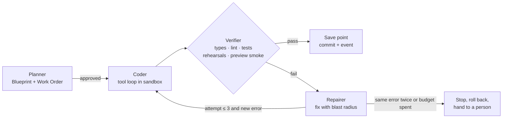
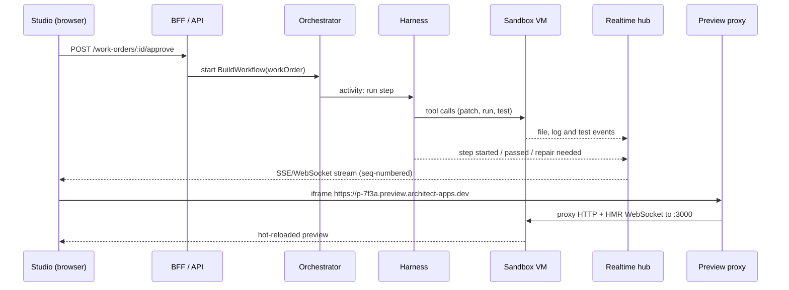

# Architect 2.0: technical architecture

How Architect 2.0 runs in production, service by service, with the reasoning behind each choice.

- Interactive version: **[architect-2-aryan.vercel.app/architecture](https://architect-2-aryan.vercel.app/architecture)**
- Diagram files: [`public/docs/architecture-diagram.png`](public/docs/architecture-diagram.png) · [`public/docs/architecture.pdf`](public/docs/architecture.pdf)
- Product decisions: [`DECISIONS.md`](DECISIONS.md) · Market research: [`RESEARCH.md`](RESEARCH.md)


---

## 1. Design principles

1. **The model decides, code does the rest.** Models produce small, structured decisions (a Blueprint, a change proposal, a tool call). Deterministic code expands, validates, renders and deploys them. This keeps output reproducible, diffable and cheap, and it is why the prototype can fall back to scripted paths without breaking.
2. **Nothing runs without a price.** Every piece of work is quoted before it starts (a Work Order) and metered after. Budgets and caps are enforced in the platform, not in a dashboard.
3. **Untrusted code never shares a kernel.** Everything a user or a model writes runs inside a per-project microVM with no secrets inside it.
4. **Every agent action passes a gateway.** In the studio and in production, tool calls go through one policy point that knows the tool's risk (Read, Change, Can't undo), can ask a person first, and records a trace.
5. **Durable by default.** Plans, builds, repairs, deploys and imports are long-running workflows that survive restarts, retries and people closing the tab.
6. **One source of truth, two faces.** The Blueprint (JSON) and the repository are kept in sync, so a person who never reads code and an engineer who never opens the studio are editing the same project.

## 2. The planes at a glance

| Plane | What lives there | Why it is separate |
|---|---|---|
| **Edge** | CDN + WAF, API gateway, preview proxy, realtime hub, app router | Global, latency sensitive, terminates TLS and WebSockets, enforces rate limits before anything expensive happens |
| **Control plane** | Web app + BFF, project service, orchestrator, agent harness, model gateway, GitHub service, deploy service, import, budget, policy | Stateless and horizontally scalable. Owns decisions, never runs user code |
| **Sandbox plane** | Sandbox manager, one Firecracker microVM per project, egress proxy | Runs untrusted code with hard isolation and its own capacity model |
| **Runtime plane** | Architect Cloud (live apps), agent gateway, queues and schedules, production evals, self-hosted runtime | Serves end users with production SLOs, separate from build traffic |
| **Data + platform** | Postgres (Supabase), Redis, object storage, vector index, secrets vault, usage warehouse, observability | Shared services with their own scaling and backup policies |

## 3. Services and the reasoning behind them

| Service | Responsibility | Technology | Why this choice |
|---|---|---|---|
| Web app + BFF | Studio UI, server actions, session handling | Next.js (App Router) on Vercel | Server components give real first paint; server actions keep mutations close to the UI; the prototype already runs this way |
| API gateway | Auth, per-user and per-IP rate limits, request quotas | Edge middleware + Redis token buckets | Rejects abuse before it reaches models or sandboxes |
| Project service | Blueprints, save points, Work Orders, diffs, comments, handoffs | Postgres with row-level security | Save points are snapshots of JSON, so restore is instant and free; RLS keeps tenants apart even if application code has a bug |
| Orchestrator | Plan, build, repair, deploy and import workflows | Temporal | Durable execution with retries, timeouts, heartbeats and signals (for example "the person approved the repair") without a hand-built state machine |
| Agent harness | Planner, coder, verifier, repairer | Workers running a shared tool loop | One loop, four roles, explicit budgets; see section 5 |
| Model gateway | One API for every model, routing, fallbacks, caching, metering | Vercel AI SDK provider registry behind an internal service | Provider-agnostic calls with typed tools and structured output; see section 6 |
| GitHub service | GitHub App, branches, PRs, checks, webhooks, sync | GitHub App + webhook consumer | Fine-grained, per-repo permissions and short-lived tokens instead of personal OAuth tokens |
| Deploy service | Builds, releases, rollouts, rollback, custom domains | Buildpacks/Nixpacks, OCI registry, Knative or Fly Machines | Build once, promote the same artefact; rollback is a pointer switch |
| Import + analysis | Clone, detect stack and agent frameworks, coverage map, House Rules | Runs inside a sandbox | Reading an unknown repo is untrusted work too |
| Budget + billing | Quotes, metering, caps, refunds | Postgres ledger + ClickHouse usage events + Stripe | Credits are a ledger, so refunds for "our fix" are exact and auditable |
| Policy + approvals | Tool permissions, House Rules, approval inbox, audit log | Postgres + policy evaluation in the gateways | One place to answer "who allowed this agent to do that" |
| Preview proxy | Maps a project subdomain to its sandbox dev server | Envoy (or a small Go proxy) with a Redis routing table | Handles WebSockets and hot reload, wakes sleeping sandboxes; see section 8 |
| Realtime hub | Streams build steps, logs, presence to the studio | NATS + SSE/WebSocket gateway | Fan-out with replay from a sequence number, so reconnecting clients miss nothing |
| Sandbox manager | Creates, snapshots, suspends, resumes microVMs; warm pools | Firecracker on bare-metal hosts (or E2B as a buy option) | Strong isolation with ~150 ms resume; see section 4 |
| Agent gateway | Enforces permissions and approvals for live agents, meters their model use | Sidecar/service in the runtime plane | The product promise ("anything that can't be undone asks a person") has to hold in production, not just in the studio |

## 4. Sandboxing

**Choice: one Firecracker microVM per project**, with gVisor containers as a fallback for small, stateless jobs.

| Option | Isolation | Start | Verdict |
|---|---|---|---|
| Firecracker microVM | Own guest kernel, KVM boundary | ~125 ms cold boot, ~150 ms snapshot resume | **Chosen.** Strong multi-tenant boundary, runs Python and Node agents, real ports, persistent disk |
| gVisor container | User-space kernel intercepts syscalls | ~1 s | Fallback for short analysis jobs; some I/O overhead |
| Plain Docker | Shared host kernel | ~1 s | Rejected. One container escape reaches every tenant |
| Browser WebContainers | Browser tab | Instant | Rejected. Node only, so no LangGraph, CrewAI or Google ADK agents in Python, and no long-running jobs |

**Why a VM per project, not per request.** Agentic apps need a dev server, package caches, a language server and a Python environment that persist between prompts. Recreating those per request costs minutes; resuming a snapshot costs milliseconds.

**Lifecycle.**

1. *Create*: the manager takes a VM from a **warm pool** of pre-booted images per stack (Next.js + Python, Vite + Node), attaches the project's persistent volume and injects a short-lived identity token.
2. *Run*: 2 vCPU and 4 GB by default, CPU overcommitted about 4:1 because most time is spent waiting for models. Hard limits on memory, disk, processes and wall-clock per command.
3. *Suspend*: after 10 idle minutes the VM is snapshotted (memory + disk diff) to local NVMe and to object storage, then released.
4. *Resume*: a preview request or a new Work Order restores the snapshot on any host in about 150 ms (warm host) to 2 s (cold fetch).
5. *Destroy*: projects idle for 14 days keep only the disk image and git history.

**Security.**

- **No secrets inside the VM.** Code sees placeholders such as `ARCHITECT_SECRET_stripe`. The egress proxy swaps the real value in on the way out, only for hosts that connection is allowed to call.
- **Egress allow-list** per project: package registries, the declared connections, the model gateway. The cloud metadata endpoint and private ranges are blocked.
- Per-VM network namespace, seccomp-filtered jailer, read-only base image, no host mounts.
- Abuse controls: CPU-pattern detection for crypto mining, outbound rate limits, per-tenant quotas.

## 5. The agent harness

The harness turns a request into verified changes. It has four roles that share one tool loop:



**Planning.** The planner produces a *decision-only* draft: data, connections, agents with their tools and risk, screens and their purpose. Code expands it into a full Blueprint (JSON, validated with zod) and checks every reference: a table column must exist on its entity, a tool must point at a declared connection. The estimate is always recomputed by code, never trusted from the model. This is exactly what the prototype does today (`lib/llm/draft.ts`, `lib/llm/expand.ts`, `lib/blueprint/validate.ts`).

**Code generation.** Most files are a pure function of the Blueprint (`lib/codegen/*`): routes, blocks, schema, agent files in six frameworks. The model writes only what the Blueprint cannot express (custom logic, integrations), inside files the Blueprint marks as custom. This keeps diffs small and makes the Blueprint and the repo two views of one project.

**Tools available in the loop.**

| Tool | Purpose | Guardrail |
|---|---|---|
| `fs.read`, `fs.patch`, `fs.write` | Edit files | House Rules path filters ("never touch /legacy") |
| `shell.run` | Install, build, run scripts | Timeout, output cap, no network except allow-list |
| `test.run`, `rehearse.run` | Unit tests and agent rehearsals | Results parsed into structured pass/fail |
| `preview.check` | Headless browser loads the preview, returns console errors and a screenshot | Runs against the sandbox only |
| `repo.search`, `repo.map` | Symbol search over a tree-sitter repo map | Keeps context small |
| `docs.lookup` | Framework docs from the vector index | Versioned to the project's dependencies |
| `git.commit` | Commit to the Work Order branch | Only after the verifier passes |

**Context management.** The Blueprint is the long-term memory (a few KB, always in context). The repo map gives symbols, not whole files. Each step gets a token budget; older turns are summarised; large tool outputs are stored as artefacts and referenced by id.

**Error recovery.**

- *Transient* (429, 5xx, timeouts): retried by the orchestrator with backoff, then failed over to another provider by the model gateway.
- *Invalid output* (schema mismatch): re-asked once with the validation errors, then the step falls back to a rule-based path.
- *Build or test failure*: the repairer proposes a fix with its blast radius (screens, agents, files). In the product this is the "Architect caught a problem" card, and the fix is labelled **Our fix · free**.
- *Doom loops*: errors are normalised (paths, line numbers and ids stripped) and hashed. The same signature twice, or three attempts, stops the loop, restores the last save point and opens a handoff with the full context.
- *People stop runs*: a stop signal cancels the workflow; unused credits are refunded by the ledger.

**Budgets.** Each Work Order carries a ceiling on credits, steps and wall-clock time. The harness checks the ceiling before every model call and every tool call.

## 6. Model-agnostic switching

All model traffic goes through the **model gateway**. Callers ask for a *task*, not a model:

```ts
gateway.generate({ task: "plan", schema: DraftSchema, prompt, budget })
gateway.stream({ task: "agent-chat", tools, toolApproval, messages })
```

- **Provider registry.** Anthropic, OpenAI, Google, and open models served by vLLM, Bedrock, Vertex or Groq, all behind the Vercel AI SDK interface. The prototype already isolates this behind one `getModel()` seam (`lib/llm/provider.ts`), so adding providers is configuration.
- **Capability matrix.** For each model: tool calling, structured output mode, context window, vision, price per million tokens, p50/p95 latency. Routing refuses a model that lacks a capability the task needs.
- **Routing policy per task.** Planning and repair use a frontier model (for example Claude Opus 5). Code edits use a strong mid-tier model. Summaries, classification and naming use a small model. Embeddings use a dedicated model.
- **Failover chain.** On rate limits or outages, the gateway retries with the next model in the chain that satisfies the task's capabilities, and records the switch in the trace.
- **Customer control.** Workspaces can bring their own keys, pin a provider for data-residency reasons, or point at a private endpoint (Bedrock, Azure OpenAI, a self-hosted vLLM cluster).
- **Prompt adapters.** Per model family, not per call site: system-prompt placement, tool schema dialect, JSON mode.
- **Eval-gated switches.** A model can only become the default for a task after it passes the golden rehearsal suite for that task (plan validity, repair success, agent safety). No silent regressions.
- **Metering and caching.** Every call records tokens, cost and latency against the project and the person (the prototype does this today in `lib/llm/pricing.ts` and `usage_events`). Prompt caching is on by default for the long, stable prefix (instructions + Blueprint).

## 7. Frontend, sandbox and backend communication, with live preview



- **Commands** (approve, tweak, restore, go live) are HTTPS calls to server actions or the API. They are idempotent, keyed by a client request id.
- **Streams**: planning and agent chat stream over SSE directly from the BFF (the prototype does this for planning and the agent playground). Build and deploy progress stream through the realtime hub, which assigns sequence numbers so a reconnecting client resumes from the last event it saw.
- **Live preview** is an iframe pointed at the project's preview subdomain. The dev server in the VM serves it, the preview proxy carries both HTTP and the hot-reload WebSocket, and a small injected bridge script maps DOM nodes to Blueprint block ids over `postMessage`. That bridge powers click-to-tweak and comment pins, which in the prototype are implemented against the spec renderer.
- **Terminal and logs** for engineers use a PTY over WebSocket through the same hub, gated by project role.

## 8. The proxy layer

There are three proxies, each with one job.

**Preview proxy (inbound to sandboxes).**

- Wildcard DNS and TLS for `*.preview.architect-apps.dev`, a **separate registrable domain** from the studio so preview code can never read studio cookies.
- Routing table in Redis: `subdomain → (host, vm id, port)`, updated by the sandbox manager on every resume.
- Access control: a short-lived signed cookie scoped to one project, minted by the BFF when the studio loads the preview. Shared preview links carry their own expiring token.
- WebSocket upgrades pass through for HMR.
- **Wake on request**: if the VM is suspended, the proxy holds the request, asks the manager to resume, and streams a "waking up" page if resume takes longer than a second.
- Per-project rate limits and request size limits; strict CSP and `frame-ancestors` so previews only embed in the studio.

**Egress proxy (outbound from sandboxes).** Allow-list per project, secret injection by placeholder (section 4), request logging, metadata endpoint blocking.

**Agent gateway (runtime, for live agents).** Every tool call from a production agent is checked against its permission (Read, Change, Can't undo) and its supervision level. "Ask first" tools create an approval request (web, Slack or email) and the workflow waits on a signal. Model calls from live agents are routed through the model gateway so they count against the app's budget cap. Every call produces a trace for replay and for production evals.

## 9. GitHub integration


- **GitHub App**, installed per repository, with short-lived installation tokens. No personal access tokens stored.
- **Connect or create**: a new project can create a repo; an existing repo is imported through the import pipeline (clone into a sandbox, detect stack and agent frameworks, coverage map, House Rules). The prototype's import runs these reads and detections for real against public repos (`lib/import/*`).
- **Branch per Work Order**, commits authored by the app with the person as co-author, PR body generated from the Work Order.
- **Two-way sync**: pushes from engineers arrive by webhook. Files that are generated from the Blueprint (for example `agents/*/agent.yaml`, `RULES.md`) are parsed back into Blueprint operations; everything else stays as custom code. Conflicts become a decision card in the studio, never a silent overwrite.
- Protected `main`; merge triggers deploy to the test environment; the Ship tab promotes to live.
- Webhooks are verified, deduplicated by delivery id and processed in an idempotent workflow.

## 10. Deployment

**User apps.**

1. **Preflight** (the prototype's Ship tab): sign-in configured, keys present, irreversible tools gated, rehearsals passing, spending cap set, data region chosen. Blocking checks disable the button and name the blocker.
2. **Build once**: Buildpacks or Nixpacks inside the sandbox produce an OCI image plus static assets; the release id is immutable.
3. **Targets**:
   - *Architect Cloud*: Knative or Fly Machines with scale to zero, a Postgres branch per app (Neon or a Supabase project), secrets from the vault, the agent gateway as a sidecar, custom domains with automatic TLS.
   - *Vercel*: deploy through the Vercel API into the customer's team, env vars synced.
   - *Customer VPC or on-prem*: Helm chart or Terraform module for the runtime and agent gateway, connected to the control plane through an outbound-only tunnel. Data and traces stay in the customer's network.
4. **Rollout**: canary 5% → 50% → 100% with automatic rollback on error rate or latency SLO breach.
5. **Rollback** is instant: the router points at the previous release. Database migrations use expand-and-contract so old releases keep working.

**Architect itself.**

- Studio and BFF on Vercel (as today). Control-plane services on Kubernetes (EKS or GKE) deployed by Argo CD from Git.
- Temporal Cloud for workflows, Supabase Postgres, Redis, NATS, S3-compatible storage, ClickHouse.
- Sandbox fleet on bare-metal instances running Firecracker, managed by our sandbox manager, with a managed provider (E2B) as burst capacity.
- Regions: US, EU and India to start, each a full stack; a project lives in one region for data residency.
- CI/CD: GitHub Actions runs typecheck, lint, fixtures checks and Playwright end-to-end tests (as the repo's CI does today), deploys a preview per PR, then staging, then a canary in production behind feature flags.

## 11. Scaling to thousands of concurrent users

**Capacity model** for 5,000 people in the studio at the same time:

| Resource | Assumption | Estimate |
|---|---|---|
| Awake sandboxes | ~30% of people have work running, the rest are snapshotted | ~1,500 microVMs |
| Sandbox hosts | 4 GB each, memory bound, 384 GB per host, 25% headroom | ~20 bare-metal hosts per region at peak |
| Model traffic | ~20% actively generating, ~2 calls a minute, ~8k input and ~1k output tokens per call | ~16M input and ~2M output tokens a minute, about 70% of input served from prompt cache |
| Realtime | One connection per open studio | 5,000 connections; one NATS cluster with WebSocket gateways handles 100k+ |
| Database writes | ~1 build event per second per active build, batched | ~1,000 writes a second, well within one Postgres primary |

**How each bottleneck is handled.**

- **Control plane**: stateless pods autoscale on CPU and queue depth. Long work lives in Temporal, so scaling down never kills a build.
- **Sandboxes**: warm pools per stack, bin-packing by memory, idle suspend after 10 minutes, per-tenant concurrency quotas, burst to a managed provider when the fleet is full.
- **Models**: the gateway keeps token buckets per provider, key and region, queues by priority (a person waiting beats a background eval), fails over between providers, and uses provisioned throughput for the planner tier. Cheaper models take low-risk steps.
- **Cells**: tenants are sharded into cells of about 1,000 active users, each with its own sandbox pool, queues and Temporal namespace. A bad deploy or a noisy tenant affects one cell, not everyone.
- **Database**: connection pooling (Supavisor), read replicas for dashboards, monthly partitions for events and usage, usage analytics in ClickHouse rather than Postgres.
- **Cost**: budgets and caps per person and per app, prompt caching, deterministic codegen for most files, and snapshots instead of idle machines.

**SLOs**: studio actions p95 under 300 ms, first plan event under 2 s, sandbox resume p95 under 1 s, preview availability 99.9%, live apps 99.95%.

## 12. Security, tenancy and observability

- **Tenancy**: row-level security on every table (in the prototype today), per-tenant encryption keys for secrets, per-project sandboxes and networks.
- **Identity**: Supabase Auth with Google, email and guest sessions that can be upgraded without losing work (real today); SAML SSO and SCIM for enterprise.
- **Audit**: every approval, permission change, deploy and rollback is an append-only audit event, visible in the studio's activity feed.
- **Observability**: OpenTelemetry traces from the browser action through the workflow, each model call (tokens, cost, latency) and each sandbox command. Per-project cost dashboards come from the usage warehouse. Agent replays in the product are built from the same traces.

## 13. What the prototype runs today

| Part | In the live prototype | In production |
|---|---|---|
| Studio, auth, data | **Real.** Next.js 16 on Vercel, Supabase Auth (Google, email, guest sessions you can keep), Postgres with RLS on every table | Adds SAML SSO, SCIM, regions |
| Planner | **Real.** Claude plans a structured draft, streamed live; code expands and validates it; starter plans when no model is available | Same contract, through the model gateway |
| Model gateway | **Real, single provider.** `getModel()` seam, env-based switch, per-call token and cost metering, daily budgets per person | Multi-provider routing, failover, BYOK, caching |
| Change requests | **Real.** Claude proposes JSON Pointer operations; code applies and validates them; priced Work Order; save point | Same, executed by the harness in a sandbox |
| Agent playground + approvals | **Real.** Agents run on Claude with tools; "Ask first" tools pause for a person (AI SDK tool approval) | Same policy enforced by the agent gateway in production |
| Build + repair | **Simulated, labelled.** Deterministic build timeline; the repair decision is real and changes the Blueprint | Full tool loop in microVMs |
| Sandbox + live preview | **Simulated, labelled.** Preview renders the Blueprint with a spec renderer; no untrusted code runs | Firecracker microVMs behind the preview proxy |
| GitHub | **Partly real.** Public repo reads, stack and agent detection, House Rules; pushes and PRs are sandboxed | GitHub App with two-way sync |
| Deploy | **Real for Architect Cloud.** Public `/live/…` URL served from a published snapshot, with rollback; Vercel and VPC are sandboxed | Immutable releases, canary, instant rollback |

## 14. Trade-offs and alternatives considered

- **Build vs buy sandboxes.** E2B, Daytona and Modal would get us to market faster; we start with E2B for burst capacity and run our own Firecracker fleet for cost and control at steady state.
- **Temporal vs a queue.** A plain queue plus a state table is simpler on day one, but builds with human approvals in the middle are exactly what durable workflows are for.
- **Blueprint-first vs code-first.** Code-first (like IDE agents) is more flexible; Blueprint-first is what lets non-technical people review a plan, price it and roll it back. We keep both by syncing them, and by letting custom code live outside the Blueprint under House Rules.
- **One repo per project.** Simpler permissions and a clean handoff to engineers; monorepo support comes through the import pipeline and House Rules.
- **Multi-framework agents.** We compile one agent definition into six frameworks (Lyzr ADK, LangGraph, CrewAI, OpenAI Agents SDK, Google ADK, Mastra) and list what does not translate, instead of pretending the frameworks are equivalent.
