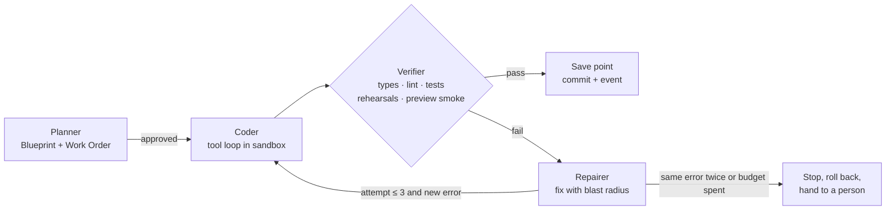
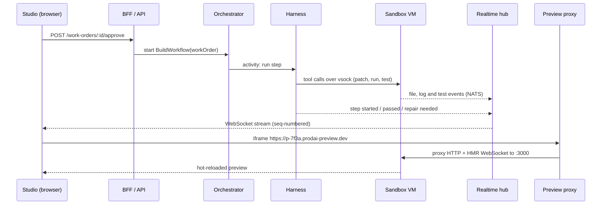
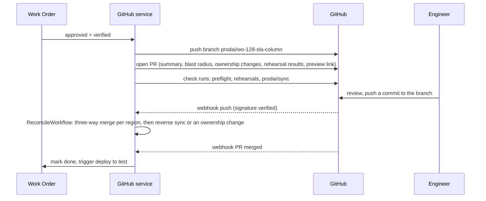

# Prod AI: technical architecture

How Prod AI (my prototype for Lyzr's Architect 2.0 brief) runs in production, service by service, with the reasoning behind each choice.

- Interactive version: **[architect-2-aryan.vercel.app/architecture](https://architect-2-aryan.vercel.app/architecture)**. Hover over or focus (Tab) a numbered badge to highlight that flow's lines and read the step.
- Diagram files: [`public/docs/architecture-diagram.png`](public/docs/architecture-diagram.png) · [`public/docs/architecture.pdf`](public/docs/architecture.pdf)
- Product decisions: [`DECISIONS.md`](DECISIONS.md) · Market research: [`RESEARCH.md`](RESEARCH.md)


**Reading the diagram.** The legend at the bottom explains every line style and colour. Each service is a card and each line is a real call path. Solid lines are request and response (HTTPS, gRPC, vsock); dashed lines are asynchronous (events, webhooks, approval messages); a line's colour is the plane it belongs to. Short vertical lines join neighbours in a column (BFF → Orchestrator). Long routes run in the gutters between planes and in the two bands above and below the planes. Each plane reaches the data platform through one labelled trunk into a shared data bus, so the picture shows which plane uses which store without drawing 30 separate lines. The shared infrastructure sits there too: NATS JetStream, Temporal Cloud and the per-app Neon databases. The Orchestrator → Agent harness line also stands for the orchestrator's other activity workers (Deploy, Import, GitHub service), which pull work from Temporal task queues ([section 5](#5-communication-and-protocols)). The numbered badges match the eight steps in [section 3](#3-prompt-to-production), and the mono label next to each badge names its transport.

---

## Contents

1. [Design principles](#1-design-principles)
2. [The planes at a glance](#2-the-planes-at-a-glance)
3. [Prompt to production](#3-prompt-to-production)
4. [Services and the reasoning behind them](#4-services-and-the-reasoning-behind-them)
5. [Communication and protocols](#5-communication-and-protocols)
6. [Sandboxing](#6-sandboxing)
7. [The agent harness](#7-the-agent-harness)
8. [Blueprint and code: keeping them in sync](#8-blueprint-and-code-keeping-them-in-sync)
9. [Model-agnostic switching](#9-model-agnostic-switching)
10. [Frontend, sandbox and backend communication, with live preview](#10-frontend-sandbox-and-backend-communication-with-live-preview)
11. [The proxy layer](#11-the-proxy-layer)
12. [GitHub integration](#12-github-integration)
13. [Deployment](#13-deployment)
14. [Scaling to thousands of concurrent users](#14-scaling-to-thousands-of-concurrent-users)
15. [Model unit economics](#15-model-unit-economics)
16. [Security, tenancy and observability](#16-security-tenancy-and-observability)
17. [What the prototype runs today](#17-what-the-prototype-runs-today)
18. [Trade-offs and alternatives considered](#18-trade-offs-and-alternatives-considered)

## 1. Design principles

1. **The model decides, code does the rest.** Models produce small, structured decisions (a Blueprint, a change proposal, a tool call). Deterministic code expands, validates, renders and deploys them. This keeps output reproducible, diffable and cheap, and it is why the prototype can fall back to scripted paths without breaking.
2. **Nothing runs without a price.** Every piece of work is quoted before it starts (a Work Order) and metered after. Budgets and caps are enforced in the platform, not in a dashboard ([section 15](#15-model-unit-economics)).
3. **Untrusted code never shares a kernel.** Everything a user or a model writes runs inside a microVM with no secrets inside it: one per project in the studio, one per pod in production.
4. **Every agent action passes a gateway.** In the studio and in production, tool calls go through one policy point that knows the tool's risk (Read, Change, Can't undo), can ask a person first, and records a trace. In production the network enforces this, not the app: live apps hold no credentials and have no route out except through the gateway ([section 11](#11-the-proxy-layer)).
5. **Durable by default.** Plans, builds, repairs, deploys and imports are long-running workflows that survive restarts, retries and people closing the tab.
6. **One source of truth, two faces.** The Blueprint (JSON) and the repository are kept in sync, and every region of code has exactly one owner, so a person who never reads code and an engineer who never opens the studio are editing the same project ([section 8](#8-blueprint-and-code-keeping-them-in-sync)).

## 2. The planes at a glance

| Plane | What lives there | Why it is separate |
|---|---|---|
| **Edge** | CDN + WAF (Cloudflare), regional API gateway, preview proxy, realtime hub, app router | Latency sensitive, terminates TLS and WebSockets, enforces rate limits before anything expensive happens |
| **Control plane** | Web app + BFF, project service, orchestrator, agent harness, model gateway, GitHub service, deploy service, import, budget, policy | Stateless and horizontally scalable, in each regional Kubernetes cluster. Owns decisions, never runs user code |
| **Sandbox plane** | Sandbox manager, one Firecracker microVM per project, egress proxy, package mirror | Runs untrusted code with hard isolation and its own capacity model |
| **Runtime plane** | Prod Cloud (live apps, one microVM per pod), agent gateway (their only way out), queues and schedules, production evals, self-hosted runtime | Serves end users with production SLOs, separate from build traffic |
| **Data + platform** | Postgres (Supabase), Redis, NATS JetStream, Temporal Cloud, object storage, vector index, secrets vault, Neon app databases, usage warehouse, observability | Shared services with their own scaling and backup policies |

**Where the studio runs, and why not on Vercel.** The prototype runs on Vercel. In production the studio's Next.js app, which is also the BFF, runs as a container (`output: "standalone"`) in each regional Kubernetes cluster, next to the services it calls. The request path is: browser → Cloudflare (WAF, static assets, region steering from the JWT's region claim) → the regional API gateway (Envoy, the only public entry into a region) → BFF → services over mTLS gRPC, with the gateway choosing the cell from the workspace id. Vercel keeps what holds no tenant data (the marketing site and docs) and stays a deploy target for customers' apps. I considered keeping the BFF on Vercel, calling a regional gateway over HTTPS through Vercel Secure Compute with signed service tokens, and rejected it for three reasons:

1. **Identity.** Vercel Functions cannot hold our SPIFFE workload identities, so every call into a cell would need a token exchange at the gateway. That is a second trust domain to secure, on the hottest path in the product.
2. **Residency.** An EU workspace's brief and Blueprint must be processed in the EU. On Vercel that means one project per region with pinned function regions; in the regional cluster it is true by construction.
3. **Long-lived connections.** Planning streams and workflow signals are simpler in a pod than in a function with a duration limit.

What I give up is Vercel's zero-ops hosting and per-PR previews for the studio. Per-branch namespaces on the dev cluster replace the previews ([section 13](#13-deployment)).

## 3. Prompt to production

One request, end to end. The eight steps match the eight numbered badges on the diagram and the flow cards on the [architecture page](https://architect-2-aryan.vercel.app/architecture). Latencies are design targets.

**Step 1. Describe.**
- **Services:** Builder studio → CDN + WAF (Cloudflare) → API gateway (regional Envoy) → Web app + BFF (in the regional cluster) → Project service, Budget + billing.
- **Transport:** HTTPS POST (server action) with an idempotency key to the regional API gateway, then mTLS inside the cluster; the plan streams back over SSE from the BFF.
- **Data:** the brief (a few KB of text) plus answers to three clarifying questions. The BFF creates the project row and the Work Order in `draft`.
- **User sees:** the plan appear line by line, first event in under 2 s. Nothing runs and nothing is charged until they approve.

**Step 2. Plan.**
- **Services:** BFF → Orchestrator (`PlanWorkflow`) → Agent harness (planner role) → Model gateway → Model providers. Budget + billing prices the result; Project service stores it.
- **Transport:** gRPC `StartWorkflow` over mTLS (workflow id = Work Order id, so a double click never starts two plans); Temporal task queue to the harness; gRPC stream to the model gateway; HTTPS streaming to the provider.
- **Data:** the planner returns a *decision-only* draft (about 2-4 KB of JSON). Code expands it into a full Blueprint (10-30 KB), validates every reference with zod, and computes the quote from the Blueprint (never from the model). Every model call writes a usage event (tokens, cost, latency) to the usage warehouse.
- **User sees:** the **Work Order** card: what will change, estimated time, credits, blast radius (screens, agents, files), and an Approve button. Approving places a credit hold in the ledger and sends a Temporal signal that starts `BuildWorkflow`.

**Step 3. Build in a sandbox.**
- **Services:** Orchestrator → Agent harness (coder, verifier, repairer) → Sandbox manager → Project sandbox (Firecracker microVM) → Egress proxy → Package mirror. Policy + approvals checks every tool call.
- **Transport:** gRPC to the sandbox manager (`Acquire`: a warm-pool VM or a snapshot resume, about 150 ms on the same host); tool calls over **vsock** to an in-VM agent, with stdout streamed back; `npm install` and `pip install` leave only through the egress proxy, which sends registry traffic to the regional package mirror.
- **Data:** generated files (most are a pure function of the Blueprint), patches from the coder, test and rehearsal results as structured pass/fail. After each verified step: a git commit inside the VM, a Temporal activity result, and a save point in the Project service.
- **User sees:** the **build console**, with plain-English steps in three lanes (thought, did, checked) and a progress bar. If the verifier fails, the **repair card** ("Prod AI caught a problem") shows what broke, the blast radius and two fixes. Fixes for our own mistakes are labelled **Our fix · free**, and the platform pays for them ([section 15](#15-model-unit-economics)). Picking one sends a signal and the workflow resumes.

**Step 4. Live preview.**
- **Services:** Builder studio → Preview proxy → Project sandbox dev server (`:3000`); Sandbox manager on wake.
- **Transport:** an iframe on `https://{project}.prodai-preview.dev`, HTTP plus the hot-reload WebSocket, routed through a Redis table `subdomain → (host, vm, port)`. The BFF mints a signed, project-scoped preview cookie.
- **Data:** HTML, JS and HMR updates from the dev server; a `postMessage` bridge maps DOM nodes to Blueprint block ids through the `data-block` attributes codegen emits, with fallbacks for code that has none ([section 8](#8-blueprint-and-code-keeping-them-in-sync)). This powers click-to-tweak and comment pins.
- **User sees:** the app changing in place as files are written. A sleeping sandbox shows "waking up" for about a second, then the preview.

**Step 5. Show the work.**
- **Services:** in-VM file watcher and the harness → host daemon → NATS JetStream → Realtime hub → Builder studio.
- **Transport:** vsock out of the VM, NATS subjects `proj.{id}.build.*` on the host, WebSocket (SSE fallback) to the browser. Every event carries a sequence number.
- **Data:** step started, file changed, test passed, repair needed, spend so far. A reconnecting tab asks for "everything after seq N" and JetStream replays it.
- **User sees:** progress in plain English instead of a spinner, and the spend meter moving against the Work Order's ceiling.

**Step 6. Branch + PR.**
- **Services:** Agent harness → GitHub service → GitHub; webhooks come back through the API gateway to the GitHub service. Import + analysis uses the same GitHub App for existing repos.
- **Transport:** git over HTTPS and the REST API with a GitHub App installation token (expires after an hour); inbound webhooks verified with `X-Hub-Signature-256` and deduplicated by `X-GitHub-Delivery`.
- **Data:** branch `prodai/wo-128-sla-column`, a PR whose body is the Work Order (summary, blast radius, ownership changes, rehearsal results, preview link), and check runs for preflight, rehearsals and sync. An engineer's push comes back as a webhook and goes through the region-level reconcile in [section 8](#8-blueprint-and-code-keeping-them-in-sync): a three-way merge, then reverse sync into the Blueprint or a change of ownership.
- **User sees:** a PR link on the Work Order. An engineer's fix appears as one plain-English line in the activity feed. A conflict becomes a conflict card, never a silent overwrite.

**Step 7. Ship.**
- **Services:** Builder studio → BFF → Deploy service (preflight reads Policy, Budget and the vault) → Orchestrator (`DeployWorkflow`) → Project sandbox (build) → object storage (OCI registry) → Prod Cloud, Vercel, or the runtime in your VPC.
- **Transport:** HTTPS for "Go live"; gRPC between services; the Knative API on the regional runtime cluster for Prod Cloud, the Vercel REST API for Vercel, and an outbound-only mTLS tunnel for a customer VPC.
- **Data:** one immutable release (OCI image digest, static assets, migration plan, secret *references* only). Migrations use expand-and-contract, so the old release keeps working during the rollout.
- **User sees:** the **preflight** checklist (sign-in configured, keys present, irreversible tools gated, rehearsals passing, spending cap set, data region chosen, no open conflict cards). Blocking checks disable the button and name the blocker. Then a canary rollout (5% → 50% → 100%) and the **live URL** (`{app}.prodai.app` or a custom domain), with "Update the live version" and one-click rollback.

**Step 8. Governed agents.**
- **Services:** People using live apps → CDN + WAF → App router → Prod Cloud → Agent gateway → Model gateway, third-party APIs, Queues + schedules, Notify, Evals in production.
- **Transport:** HTTPS and WebSocket from end users. Every outbound call the app makes (tool calls, model calls, plain API calls) goes to the cell's agent gateway, the only egress route the pod has: gRPC for declared tools, an HTTPS proxy for everything else. "Ask first" approvals go out as Slack and email messages and come back as a Temporal signal.
- **Data:** each call with its risk level (Read, Change, Can't undo), the caller and the arguments; budget checks against the app's cap; the credential, added by the gateway only after the check passes; OpenTelemetry traces and usage events. Sampled traces are replayed against the rehearsal suite on a schedule.
- **User sees:** a working app for end users. For the builder: an approvals inbox, per-app spend, agent replays, drift alerts and any blocked egress attempts.

## 4. Services and the reasoning behind them

Each row names a concrete choice, why, and what I rejected.

**Edge**

| Service | Responsibility | Choice | Why | Rejected |
|---|---|---|---|---|
| CDN + WAF | Static assets, TLS, bot and DDoS protection, region steering | Cloudflare for every hostname: the studio, `*.prodai-preview.dev` and live-app domains (CDN, managed WAF rules, bot management) | One WAF policy for all traffic, DDoS absorption and custom-hostname TLS at scale; a Worker reads the region claim and sends each request to the workspace's home region | Vercel's edge for the studio plus Cloudflare for user traffic: two WAF policies and two places to steer regions. CloudFront + AWS WAF: custom-domain TLS for thousands of customer hostnames would be ours to build |
| API gateway | The only public entry into a region: auth, per-user and per-IP rate limits, quotas, cell routing, webhook ingress | Envoy Gateway per region behind Cloudflare; JWT validation, Redis-backed global rate limiting, `workspace → cell` lookup | Rejects abuse before it reaches models or sandboxes, and keeps the BFF and every service behind it private | Rate limits inside each service: inconsistent, and abusive traffic still reaches expensive paths |
| Preview proxy | Maps a project subdomain to its sandbox dev server | Envoy (or a small Go proxy) with a Redis routing table | Handles WebSockets and hot reload, wakes sleeping sandboxes; see [section 11](#11-the-proxy-layer) | Exposing VM ports directly or a tunnel per VM: no central auth, no wake-on-request |
| Realtime hub | Streams build steps, logs, presence to the studio | NATS JetStream + a WebSocket/SSE gateway | Fan-out with replay from a sequence number, so reconnecting clients miss nothing | Supabase Realtime or Postgres `LISTEN/NOTIFY`: no replay by sequence, and it puts build chatter on the primary database |
| App router | Custom domains, TLS, routing live traffic to the right release and region | Cloudflare for SaaS custom hostnames in front of an Envoy tier; `host → (app, release, region)` in Postgres, cached in Redis | Certificates issue automatically when a customer adds a CNAME to `cname.prodai.app`; rollback is a pointer change in one table | A Kubernetes Ingress per app: thousands of hosts means slow config reloads and churn |

**Control plane**

| Service | Responsibility | Choice | Why | Rejected |
|---|---|---|---|---|
| Web app + BFF | Studio UI, server actions, session handling | Next.js (App Router) as a standalone container in each regional cluster, inside the service mesh | Server components give real first paint; server actions keep mutations close to the UI; in the cluster it holds a workload identity, calls Temporal and services over mTLS, and stays in-region by construction ([section 2](#2-the-planes-at-a-glance)) | Keeping it on Vercel: needs a Secure Compute or public path into every cell plus a token exchange, and one Vercel project per region for residency. SPA + separate REST API: two deploys and a slower first paint |
| Project service | Blueprints, save points, Work Orders, diffs, comments, handoffs, ownership map | Postgres with row-level security | Save points are snapshots of JSON, so restore is instant and free; RLS keeps tenants apart even if application code has a bug | Git as the only store: slow restores, and non-technical edits would need commits |
| Orchestrator | Plan, build, repair, reconcile, deploy and import workflows | Temporal (Temporal Cloud) | Durable execution with retries, timeouts, heartbeats and signals (for example "the person approved the repair") without a hand-built state machine | A queue plus a state table (see [section 18](#18-trade-offs-and-alternatives-considered)); AWS Step Functions: AWS-only and harder to test locally |
| Agent harness | Planner, coder, verifier, repairer | Stateless workers pulling Temporal activities, running one shared tool loop | One loop, four roles, explicit budgets; see [section 7](#7-the-agent-harness) | A multi-agent chat framework: harder to budget, replay and stop |
| Model gateway | One API for every model, routing, fallbacks, caching, metering | Vercel AI SDK provider registry behind an internal service | Provider-agnostic calls with typed tools and structured output; see [section 9](#9-model-agnostic-switching) | Provider SDKs called from each service: no single place for failover, caps or caching |
| GitHub service | GitHub App, branches, PRs, checks, webhooks, sync | GitHub App + webhook consumer | Fine-grained, per-repo permissions and short-lived tokens instead of personal OAuth tokens | An OAuth app with user tokens: broad scopes, long-lived credentials |
| Deploy service | Preflight, builds, releases, rollouts, rollback, custom domains | Nixpacks or Buildpacks, OCI registry, Knative on the regional runtime cluster | Build once, promote the same artefact; rollback is a pointer switch | Rebuilding per environment: what you tested is not what you ship |
| Import + analysis | Clone, detect stack and agent frameworks, coverage map, House Rules | Runs inside a sandbox, using the GitHub App token for private repos | Reading an unknown repo is untrusted work too (install scripts, build hooks) | Analysing in the control plane: one malicious `postinstall` away from our credentials |
| Budget + billing | Quotes, holds, metering, caps, refunds | Postgres double-entry ledger + ClickHouse usage events + Stripe | Credits are a ledger, so refunds for "our fix" are exact and auditable | Stripe as the balance of record: too slow and coarse for per-call caps |
| Policy + approvals | Tool permissions, House Rules, approval inbox, audit log | Policies in Postgres, compiled into bundles evaluated in-process by the harness and the agent gateway | One place to answer "who allowed this agent to do that", with sub-millisecond checks on every call | OPA or Cedar as a network service: an extra hop on every tool call for three risk levels plus path rules |

**Sandbox plane**

| Service | Responsibility | Choice | Why | Rejected |
|---|---|---|---|---|
| Sandbox manager | Creates, snapshots, suspends, resumes microVMs; warm pools | Firecracker on bare-metal hosts; E2B as burst capacity, restricted to secret-free work | Strong isolation with about 150 ms resume on the same host and lazy restore across hosts; see [section 6](#6-sandboxing) | Kubernetes pods: a shared kernel between tenants |
| Project sandbox | Dev server, agent runtime, tests, language servers | One Firecracker microVM per project, persistent volume, in-VM agent on vsock | Real ports, Python and Node, state that survives between prompts | Browser WebContainers: Node only, no long-running Python agents |
| Egress proxy | All outbound traffic from sandboxes; secret injection | Envoy per sandbox host; nftables on each VM's tap device forces traffic through it | L7 allow-list by hostname, and real secrets are swapped in on the way out so they never enter the VM | IP allow-lists only: cannot filter by hostname or inject secrets; secrets as env vars in the VM: readable by any generated code |
| Package mirror | npm and PyPI packages for every sandbox | A pull-through cache per region (AWS CodeArtifact with npmjs and PyPI upstreams), reached only through the egress proxy; new versions pass OSV and malware scanning before they are served | Fast installs that survive upstream outages, and one place to block a compromised package for every tenant at once | Letting sandboxes reach public registries directly: slower, no central block list, and every install goes to the internet |

**Runtime plane**

| Service | Responsibility | Choice | Why | Rejected |
|---|---|---|---|---|
| Prod Cloud | Hosts live apps with scale to zero | Knative Serving on a regional Kubernetes cluster (EKS) with Cilium; each pod runs in its own Firecracker microVM through Kata Containers on bare-metal nodes; a Neon Postgres branch per app | Scale to zero, traffic-split canaries, and the default-deny network the agent gateway's enforcement needs ([section 11](#11-the-proxy-layer)); the same Helm chart runs in a customer's VPC. Cold start from zero is about 1-2 s with images pre-pulled; apps that cannot accept that keep one warm replica | Fly Machines (my first choice, for sub-second starts): no per-app egress policy, so a live app could call any host directly. AWS Lambda: 15-minute limit and no long-lived WebSockets for agent tasks |
| Agent gateway | The only egress from live apps: holds app credentials, enforces permissions and approvals, meters model use | An Envoy-based egress tier per cell with an in-process policy filter, on dedicated nodes; live-app pods are default-deny and can reach only the gateway, DNS, the telemetry collector and their own database | The product promise ("anything that can't be undone asks a person") has to hold in production, even for hand-written code that ignores our SDK | A sidecar in the app's pod (my first design): it shares the pod's network namespace, so anything the sidecar can reach, the app can reach. Checks inside generated agent code: an engineer can edit them away |
| Queues + schedules | Triggers, retries, long-running and scheduled agent tasks | Temporal task queues and Schedules (a namespace per cell); NATS JetStream for event triggers | Agent tasks can wait days for an approval and survive restarts; one engine for studio and runtime workflows | Cron in the app container: lost when the app scales to zero; SQS alone: no durable waiting for a person |
| Evals in production | Replays rehearsals on real traces, alerts on drift | Scheduled Temporal jobs that sample traces (every "Ask first" call plus 5% of the rest), run the rehearsal suite with deterministic checks and an LLM judge through the Batch API, and write scores to ClickHouse | Catches drift from real inputs and silent model updates; the same suite gates model switches ([section 9](#9-model-agnostic-switching)) | Pre-launch evals only: miss what real users actually send |
| Your VPC or on-prem | The same runtime in the customer's network | Helm chart (runtime, agent gateway, Cilium policies, OpenTelemetry collector) plus a Terraform module for EKS, GKE or AKS; an outbound-only mTLS tunnel to our control plane. The runtime refuses to register until a canary pod proves direct egress is blocked | Data, traces and model calls stay in the customer's network; security teams approve outbound 443 far more easily than inbound access | Shipping the whole control plane on-prem: every upgrade becomes a customer project; an inbound VPN: usually a security-review blocker |

**Data + platform**

| Store | Holds | Choice | Why | Rejected |
|---|---|---|---|---|
| Postgres | Users, projects, Blueprints, Work Orders, ledger, events, audit | Supabase Postgres per region, RLS on every table, Supavisor pooling, point-in-time recovery | Already the prototype's database; RLS is the second wall between tenants | DynamoDB: no joins or RLS, and the Blueprint model is relational |
| Redis | Rate-limit buckets, preview and app routing tables, locks, session cache | Managed Valkey/Redis per region (ElastiCache) | Atomic Lua scripts for token buckets, microsecond lookups on the preview path | Rate limiting in Postgres: write amplification at thousands of requests a second |
| Event bus | Build events, usage events, approvals, handoffs | NATS JetStream, one cluster per cell (3 replicas), 7-day retention on `usage.*` | Replay by sequence for reconnecting tabs and for rebuilding ClickHouse; per-subject permissions per project | Kafka: heavier to run per cell, and coarser per-tenant auth |
| Workflow state | Workflow histories, timers, task queues | Temporal Cloud, one namespace per cell, replicated to the standby region | Durable execution without running Temporal's own database per cell | Self-hosted Temporal: a stateful cluster per cell to operate and upgrade |
| Object storage | Sandbox snapshots, build artefacts, OCI images, repo archives, last-generated code per release | S3 with versioning, lifecycle rules and same-jurisdiction replication; the registry stores its layers here | Snapshots must outlive any host so a VM can resume anywhere | Snapshots on host disks only: lost with the host and pins VMs to one machine |
| Vector index | Repo maps, framework docs, agent knowledge | pgvector (HNSW) in the regional Postgres | Same RLS, backups and region as the rest of the data; no second system to keep in sync | A dedicated vector database: another tenant boundary to secure, not needed at this scale |
| Secrets vault | Connection keys, BYOK model keys, platform credentials | AWS KMS envelope encryption: per-tenant data keys, ciphertext in Postgres; AWS Secrets Manager for platform secrets | Decryption happens only in the sandbox egress proxy and the agent gateway, and every decrypt is logged | A single platform-wide key: one leak exposes every tenant |
| App databases | Each live app's own data | Neon Postgres: a project per app, a branch per test version, reached over PrivateLink | Branching makes test versions and migrations cheap; scale to zero matches app traffic | One shared Postgres for all live apps: noisy neighbours and one blast radius |
| Usage warehouse | Tokens, credits, sandbox minutes, trace summaries | ClickHouse Cloud, batch-ingested from NATS JetStream | Fast aggregates for spend meters and cost dashboards without scanning Postgres | Analytics on Postgres: large scans compete with the studio's writes |
| Observability | Traces, metrics, logs, LLM spans, SLOs | OpenTelemetry collectors → Grafana Tempo, Mimir and Loki; Sentry for browser errors | One trace from a click to a sandbox command; open formats avoid lock-in | Per-host-priced APM: cost grows with thousands of sandboxes |
| Notify | Slack and email for approvals and handoffs | A small service subscribed to `approvals.*` and `handoffs.*` on NATS; Slack app + transactional email | Approvals reach people where they already work; Slack button clicks come back signed | Email only: approvals sit unread and agents wait |

## 5. Communication and protocols

Rules that apply to every row: service-to-service traffic is mTLS with workload identities; the end user's identity travels with each request, so Postgres RLS applies to service calls too; every mutating call carries an idempotency key; every hop propagates a W3C `traceparent`. The mono labels on the diagram's numbered flows are the transports in this table.

| From → to | Transport | Sync or async | Auth | Why |
|---|---|---|---|---|
| Studio → API gateway → BFF (commands: approve, tweak, restore, go live) | HTTPS (HTTP/2) to the regional API gateway, then mTLS inside the cluster; server actions and JSON | Sync | Supabase session cookie (HttpOnly), JWT verified at the gateway, which adds the cell route | Idempotent commands keyed by a client request id, safe to retry |
| BFF → Studio (planning, agent chat) | SSE over HTTPS (AI SDK UI message stream) | Async stream | Same session | One-way token stream that survives proxies; the prototype does this today |
| Realtime hub → Studio (build, deploy, logs, presence) | WebSocket, SSE fallback; every message has a `seq` | Async stream | 5-minute JWT scoped to one project, minted by the BFF | A reconnecting tab resumes from its last `seq`; JetStream replays the gap |
| Studio → Preview proxy → sandbox dev server | HTTPS + WebSocket upgrade (HMR) on `*.prodai-preview.dev`; plain HTTP on the host's private network to the VM | Sync | Signed, project-scoped preview cookie checked at the proxy; the VM sees no credentials | Separate registrable domain, so preview code cannot read studio cookies |
| BFF → Orchestrator | gRPC (Temporal SDK): start, signal, query | Sync call, async workflow | mTLS, one Temporal namespace per cell | Durable workflows; approvals arrive as signals |
| BFF → Project service, Budget, Policy | gRPC (Connect) | Sync | mTLS + the user's JWT forwarded, so RLS applies | Typed contracts; the database enforces tenancy even if a service has a bug |
| Orchestrator → Agent harness, Deploy, Import, GitHub service | Temporal task queues (activities with heartbeats) | Async | mTLS | Workers pull work, so scaling means adding workers; a dead worker is detected by a missed heartbeat |
| Agent harness → Model gateway | gRPC server stream | Sync, streamed | mTLS + a budget token for the Work Order | Every call is routed, priced and capped in one place |
| Model gateway → Model providers | HTTPS provider APIs with SSE streaming | Sync, streamed | Platform keys from the vault, or the customer's BYOK key; fixed egress IPs for private endpoints | Providers only speak HTTPS; fixed IPs let customers allow-list us |
| Agent harness → Sandbox manager | gRPC: acquire, snapshot, suspend, resume | Sync | mTLS | Lifecycle calls are short and must fail fast |
| Agent harness → in-VM agent | **vsock** (Firecracker virtio-vsock, host side is a Unix socket) carrying gRPC: `fs.patch`, `shell.run`, `test.run` | Sync request, streamed output | Per-VM token injected at boot; reachable only from the host | Needs no guest networking, so nothing on the internet or in another VM can reach the agent |
| Sandbox → Realtime hub | vsock to the host daemon → NATS JetStream subjects `proj.{id}.build.*` | Async | The host daemon holds a per-project NATS credential; the VM holds none | Events leave the VM without giving it credentials |
| Sandbox → Egress proxy → package mirror, declared APIs | All traffic forced through Envoy by nftables; SNI allow-list; registry hostnames routed to the regional package mirror; TLS terminated only for declared connections (the VM trusts a per-project CA) so placeholders can be swapped for real keys | Sync | Per-project allow-list and secrets | Registries and declared APIs work; secrets never enter the VM |
| GitHub → GitHub service (webhooks) | HTTPS POST via the API gateway | Async: ack within GitHub's 10-second window, then a workflow does the work | `X-Hub-Signature-256` HMAC, deduplicated by `X-GitHub-Delivery` | Pushes from engineers must never be processed twice or dropped |
| GitHub service → GitHub | git over HTTPS, REST and GraphQL | Sync | GitHub App installation token (expires after 1 hour); the app's JWT is signed inside KMS | No stored personal tokens; the App private key never leaves KMS |
| Stripe → Budget + billing (webhooks) | HTTPS POST via the API gateway | Async | `Stripe-Signature` (timestamped HMAC, 5-minute tolerance), deduplicated by event id | Payment state changes are applied exactly once |
| Budget + billing → Stripe | HTTPS API: meter events, invoices | Async, batched | Restricted API key; `Idempotency-Key` on every write | Usage is metered continuously without double charges |
| Deploy service → Prod Cloud, Vercel, your VPC | Knative API on the regional runtime cluster; Vercel REST API; commands down an outbound-only mTLS tunnel (gRPC bidirectional stream) | Async (deploy workflow) | Workload identity on the runtime cluster; the customer's Vercel integration token; per-cluster tunnel certificate | Same release, three targets; the VPC never accepts inbound connections |
| End users → App router → Prod Cloud | HTTPS and WebSocket | Sync | The app's own sign-in | Standard web traffic, routed by host name to the current release |
| Live app → Agent gateway → Model gateway, third-party APIs | Every outbound connection from the pod goes to the cell's agent gateway: gRPC `Invoke` for declared tools, an HTTPS proxy for everything else. A default-deny Cilium policy drops any other traffic | Sync; "Ask first" waits on a Temporal signal | Workload identity per app (SPIFFE); the gateway holds the app's credentials and adds them after the policy check | Every production call is checked, metered and traced, and code cannot route around it |
| Agent gateway, Policy → Notify → Slack, email | NATS `approvals.*` → Slack Web API and email | Async | Slack bot token from the vault; button clicks come back with Slack's signing secret | People approve where they already work |
| Every service → Observability, Usage warehouse | OTLP/gRPC to a node-local collector; NATS `usage.*` batched into ClickHouse | Async, batched | mTLS | Telemetry never blocks a request |

## 6. Sandboxing

**Choice: one Firecracker microVM per project**, with gVisor containers as a fallback for small, stateless jobs.

| Option | Isolation | Start | Verdict |
|---|---|---|---|
| Firecracker microVM | Own guest kernel, KVM boundary | ~125 ms cold boot, ~150 ms snapshot resume on the same host | **Chosen.** Strong multi-tenant boundary, runs Python and Node agents, real ports, persistent disk |
| gVisor container | User-space kernel intercepts syscalls | ~1 s | Fallback for short analysis jobs; some I/O overhead |
| Plain Docker | Shared host kernel | ~1 s | Rejected. One container escape reaches every tenant |
| Browser WebContainers | Browser tab | Instant | Rejected. Node only, so no LangGraph, CrewAI or Google ADK agents in Python, and no long-running jobs |

**Why a VM per project, not per request.** Agentic apps need a dev server, package caches, a language server and a Python environment that persist between prompts. Recreating those per request costs minutes; resuming a snapshot costs milliseconds.

**Lifecycle.**

1. *Create*: the manager takes a VM from a **warm pool** of pre-booted images per stack (Next.js + Python, Vite + Node), attaches the project's persistent volume and injects a short-lived identity token.
2. *Run*: 2 vCPU and 4 GB by default, CPU overcommitted about 4:1 because most time is spent waiting for models. Hard limits on memory, disk, processes and wall-clock per command.
3. *Suspend*: after 10 idle minutes the VM is snapshotted (memory + disk diff) to local NVMe and to object storage, then released. The snapshot also records the VM's working set: the pages touched by its last few requests.
4. *Resume*: a preview request or a new Work Order restores the snapshot. The scheduler prefers the host that still holds it on local NVMe (about 150 ms); otherwise any host resumes it with lazy restore (below).
5. *Destroy*: projects idle for 14 days keep only the disk image and git history.

**Resuming on another host.** An eager copy cannot meet a 2 s target. A 4 GB VM has about 1.5 GB of touched memory, and pulling that from S3 at roughly 1 GB/s, plus the disk diff, takes 2-5 s before the first instruction runs. So cross-host resume is lazy. Firecracker loads the small VM state file and hands guest memory to a userfaultfd page-fault handler (its UFFD snapshot-loading mode). The handler serves pages on demand from 2 MB chunks fetched from S3 and cached on local NVMe. It prefetches the recorded working set first and streams the rest in the background. The disk diff is attached as a block device that fills lazily the same way. A page that misses the local cache costs one S3 round trip (20-50 ms). Without the working-set prefetch, a dev server's first request would fault thousands of pages one at a time and take several seconds.

| Resume path | vCPUs running | First preview response | Fully resident |
|---|---|---|---|
| Same host, snapshot on local NVMe | ~150 ms | ~300 ms | Immediately (page cache) |
| Other host, eager copy from S3 | 2-5 s | 2-5 s | 2-5 s |
| Other host, lazy restore with working-set prefetch | ~300 ms | ~0.8-1.5 s, p95 ~2.5 s | 3-6 s, in the background |

These are design estimates for load tests to confirm. Host affinity keeps most resumes on the first row (target: at least 90% same-host), and the studio pre-warms a project's VM on its host when someone opens the project, before the first request arrives.

**Security.**

- **No secrets inside the VM.** Code sees placeholders such as `PRODAI_SECRET_stripe`. The egress proxy swaps the real value in on the way out, only for hosts that connection is allowed to call.
- **Egress allow-list** per project: the package mirror, the declared connections, the model gateway. The cloud metadata endpoint and private ranges are blocked.
- Per-VM network namespace, seccomp-filtered jailer, read-only base image, no host mounts. The in-VM agent is reachable only over vsock from the host.
- Abuse controls: CPU-pattern detection for crypto mining, outbound rate limits, per-tenant quotas.

**Burst capacity (E2B), and what it does not guarantee.** When our fleet is full, some work runs on E2B. E2B also uses Firecracker, so the kernel boundary between tenants holds. Three of our controls do not, because they live on hosts we operate:

- *No vsock agent of ours.* The harness drives the VM through E2B's HTTPS API, and build events come back through that API instead of vsock into NATS on our host.
- *No Envoy egress proxy on the VM's tap device.* No secret injection by placeholder, and no hostname allow-list that we enforce: egress is limited only by the provider's network settings.
- *No per-project CA*, so no TLS termination for declared connections.

Without injection, any secret the work needs would have to sit inside the VM, which principle 3 forbids. So eligibility is a scheduler rule computed from project facts, never a runtime judgement. A step may burst only if all of these hold:

- the project has no connected secrets and no BYOK key in scope;
- the sandbox holds no private repository, uploaded customer file or production data;
- the workspace has no data-residency pin and no contract that excludes sub-processors;
- the step does not produce a release artefact (deploy builds always run on our fleet, so every shipped image is built where we control the supply chain).

In practice that means new projects' first builds and read-only previews of public templates, which is also where demand spikes (launches, workshops). Everything else waits for our fleet, and the Work Order shows an honest queue time instead of silently running with weaker guarantees. On burst, the guarantees that degrade are stated on the Work Order step and in the security documentation: egress filtering is the provider's, not ours; events arrive a second or two later; snapshots live at E2B, so a project that returns to our fleet resumes from its last git commit, not from memory; and E2B is listed as a sub-processor.

## 7. The agent harness

The harness turns a request into verified changes. It has four roles that share one tool loop:



**Planning.** The planner produces a *decision-only* draft: data, connections, agents with their tools and risk, screens and their purpose. Code expands it into a full Blueprint (JSON, validated with zod) and checks every reference: a table column must exist on its entity, a tool must point at a declared connection. The estimate is always recomputed by code, never trusted from the model. This is exactly what the prototype does today (`lib/llm/draft.ts`, `lib/llm/expand.ts`, `lib/blueprint/validate.ts`).

**Code generation.** Most files are a pure function of the Blueprint (`lib/codegen/*`): routes, blocks, schema, agent files in six frameworks. The model writes only what the Blueprint cannot express (custom logic, integrations), inside hand-owned regions. Every region has one owner, recorded in an ownership map and fenced by markers, which is how the Blueprint and the repo stay two views of one project ([section 8](#8-blueprint-and-code-keeping-them-in-sync)).

**Tools available in the loop.** Every call is checked against Policy + approvals before it runs.

| Tool | Purpose | Guardrail |
|---|---|---|
| `fs.read`, `fs.patch`, `fs.write` | Edit files | House Rules path filters ("never touch /legacy") and region ownership: the agent writes hand-owned regions, codegen writes generated ones |
| `shell.run` | Install, build, run scripts | Timeout, output cap, no network except allow-list |
| `test.run`, `rehearse.run` | Unit tests and agent rehearsals | Results parsed into structured pass/fail |
| `preview.check` | Headless browser loads the preview, returns console errors and a screenshot | Runs against the sandbox only |
| `repo.search`, `repo.map` | Symbol search over a tree-sitter repo map | Keeps context small |
| `docs.lookup` | Framework docs from the vector index | Versioned to the project's dependencies |
| `git.commit` | Commit to the Work Order branch | Only after the verifier passes |

**Context management.** The Blueprint is the long-term memory (a few KB, always in context). The repo map gives symbols, not whole files. Each step gets a token budget; older turns are summarised; large tool outputs are stored as artefacts and referenced by id. Prompts are ordered instructions → tools → Blueprint → history, so the stable part is served from the prompt cache.

**Error recovery.**

- *Transient* (429, 5xx, timeouts): retried by the orchestrator with backoff, then failed over to another provider by the model gateway.
- *Invalid output* (schema mismatch): near-miss JSON is repaired locally (nulls, synonyms, casing); otherwise the model is re-asked once with the exact validation error, then the step falls back to a rule-based path. The prototype does exactly this for change requests (`lib/change/edits.ts`, `lib/change/propose.ts`).
- *Build or test failure*: the repairer proposes a fix with its blast radius (screens, agents, files). In the product this is the "Prod AI caught a problem" card, and the fix is labelled **Our fix · free**.
- *Doom loops*: errors are normalised (paths, line numbers and ids stripped) and hashed. The same signature twice, or three attempts, stops the loop, restores the last save point and opens a handoff with the full context.
- *Crashed workers or hosts*: each verified step is a Temporal activity result plus a git commit, so a new worker resumes from the last completed step on a restored snapshot.
- *People stop runs*: a stop signal cancels the workflow; unused credits are refunded by the ledger.

**Budgets.** Each Work Order carries a ceiling on credits, steps and wall-clock time. The harness checks the ceiling before every model call and every tool call. What a build costs, and who pays for repairs, is in [section 15](#15-model-unit-economics).

## 8. Blueprint and code: keeping them in sync

Prod AI's core claim is that a person editing the Blueprint and an engineer editing the repository are working on the same project. That holds only if every region of code has exactly one owner at any moment, and the system always knows which. This section is the mechanism.

**Ground rules.**

- Codegen is deterministic: the same Blueprint and the same codegen version produce byte-identical files. The codegen version is pinned per project, and upgrading it is its own Work Order, so an upgrade diff is never mistaken for a hand edit.
- Every generated region carries the hash of what codegen last wrote there. A hash mismatch is the only signal that someone edited generated code. There are no heuristics.
- Nothing is overwritten silently. A change either merges cleanly, moves ownership, or stops on a conflict card.

**Ownership map.** `.prodai/ownership.json` is committed to the repo, so engineers can read it and review changes to it in PRs. Every file has a mode:

| Mode | What it means | Examples | Who writes it |
|---|---|---|---|
| `generated` | The whole file is a pure function of the Blueprint | `db/schema.sql`, `agents/*/agent.yaml`, `agents/*/RULES.md`, the route manifest | Codegen only. A hand edit starts a reconcile |
| `mixed` | Generated regions between markers, hand-owned code outside them | `app/tickets/page.tsx`, `agents/triage/tools.py` | Codegen rewrites its regions; people and the coder agent write the rest |
| `hand` | Owned by people; the Blueprint references it but never writes it | `lib/pricing.ts`, anything under a House Rules path such as `/legacy` | People and the coder agent, under House Rules |

Each entry lists the Blueprint objects the file implements and, per region, the owner and the hash of the last generated content:

```json
"app/tickets/page.tsx": {
  "mode": "mixed",
  "objects": ["screen:tickets"],
  "regions": {
    "block:tickets.table":  { "owner": "blueprint", "hash": "9c1e41" },
    "block:tickets.header": { "owner": "hand", "by": "sam", "since": "wo-131" }
  }
}
```

**Region markers.** Codegen fences each generated region with comments in the file's own syntax (JSX, `#` in Python, `--` in SQL):

```tsx
{/* @prodai:begin block=tickets.table hash=9c1e41 */}
<DataTable data-block="tickets.table" entity="ticket" columns={["title", "status", "sla"]} />
{/* @prodai:end block=tickets.table */}
```

Code outside markers is hand-owned by definition. When ownership of a region moves to a person, its fence becomes `@prodai:hand block=tickets.table by=sam since=wo-132`: the id stays, so click-to-tweak and comment pins still resolve, but codegen no longer writes inside it. A malformed or deleted marker fails the `prodai/sync` check on the PR instead of being guessed at.

**When an engineer edits a generated region.** Sam hand-edits the `DataTable` region in `app/tickets/page.tsx` and pushes. The webhook starts a `ReconcileWorkflow` for that push:

1. *Detect.* The region's content no longer hashes to `9c1e41`.
2. *Three-way merge.* **Base** is the last generated version (the region as codegen wrote it at `9c1e41`, stored with the release). **Ours** is what codegen produces from the current Blueprint. **Theirs** is Sam's version. The merge runs on the syntax tree (tree-sitter), falling back to a line-level diff3. There are three outcomes:
   - *Only Sam changed it* (the common case). Sam's version wins, and reverse sync (below) tries to express the change as Blueprint operations. If it can, the region stays blueprint-owned and its hash is updated. If it cannot, **ownership moves to Sam**: the markers and the ownership map change in one commit, and the Blueprint object is marked code-owned.
   - *Both changed, and the merge is clean.* Both land, the verifier runs, and the activity feed gets one line ("Sam's Priority column merged with your SLA column").
   - *Both changed, and they conflict.* Nothing is written. The Work Order pauses on a conflict card.
3. *Verify.* A reconcile result is a normal build step: types, lint, tests and rehearsals must pass before it is committed to the Work Order branch.

The merge is deterministic code, so a reconcile costs no model tokens. Only "Combine" on a conflict card calls a model.

**The conflict card.** It names the person and the object ("Sam changed the Tickets table in code; this Work Order changes it too"), shows both changes in plain words on the Plain face and as a three-way diff on the Code face, and gives the blast radius. It offers three choices:

- *Keep Sam's version.* Ownership of the region moves to code, and the Blueprint shows "Managed in code by Sam".
- *Keep the Blueprint's version.* The region is regenerated. Sam's commit stays in git history and Sam is notified on the PR.
- *Combine.* The coder agent writes a merged version, priced as a small Work Order, verified, and pushed to the PR for Sam to review.

Preflight blocks a deploy while any conflict card is open.

**Reverse sync: code back into the Blueprint.** Parsers exist for everything the Blueprint can express: `schema.sql`, `agent.yaml`, `RULES.md`, the route manifest, and the props of marked blocks (a column added to `columns`, a changed label, a tool's risk level, a permission). A change they can parse becomes typed `ChangeOperation`s, the same type studio edits produce (`lib/blueprint/apply.ts`), so it appears in the Blueprint's history and can be undone from a save point like any other edit. A change they cannot parse (a new hook, custom JSX, a hand-written query) is never approximated: the object is marked code-owned. From then on, studio edits to that object become Work Orders that the coder agent carries out in code and an engineer reviews in a PR, instead of regeneration.

**Click-to-tweak: from a DOM node to a Blueprint block.** Codegen stamps `data-block="{block id}"` on the root element of every generated block; production builds strip it unless the app turns on in-app feedback. The preview bridge script takes the nearest ancestor with `data-block` under the click and posts `{blockId, rect}` to the studio over `postMessage`. For code without ids (imported repos, hand-owned regions, third-party components) it falls back in order:

1. *Source location.* In the sandbox dev server, a dev-only SWC plugin stamps `data-src="file:line:col"` on JSX elements in files without markers. For transpiled or bundled code the position is resolved through source maps.
2. *Component index.* Failing that, the component name from React's owner stack is looked up in the repo map's component-to-file index.
3. *Nothing.* A canvas, an iframe or third-party DOM maps to no source.

The UI only offers controls it can honour. A node that maps to a block gets **Tweak**: structured controls (fields, columns, labels, theme) that apply as Blueprint operations, instantly and at no cost. A node that maps only to a file and line gets **Ask**: the person describes the change, and it becomes a small Work Order for the coder agent in that file, with the diff shown before it applies. A node that maps to nothing gets **Ask** with a screenshot crop as context. Comment pins resolve the same way, so a comment on hand-owned code is anchored to its file and line.

**House Rules and the PR flow.** House Rules are policy on top of ownership. Path rules ("never touch /legacy", "payments/** needs review by @finance-eng") compile into the ownership map, where those paths are `hand` and locked for the agent, and into the Policy check every `fs.patch` passes. Everything the sync does lands as commits on the Work Order's branch, so the PR is the audit trail:

- The PR body lists ownership changes ("tickets.table moved to code, owner Sam") next to the blast radius.
- `CODEOWNERS` is generated from the ownership map, so changes to hand-owned paths request review from their owners.
- A required check, `prodai/sync`, fails on malformed markers, on generated files edited without a reconcile, and on open conflicts.
- The Blueprint is versioned with the branch. Merging to `main` is what makes a reconcile part of the shipped Blueprint, so the studio and the repo cannot disagree about what is live.

**In the prototype today**, codegen emits whole files from the Blueprint (`lib/codegen/*`), import writes House Rules and holds back the files they protect (`lib/import/*`), and comment pins resolve to block ids in the spec renderer. Region markers, the ownership map, the reconcile workflow, reverse sync and the conflict card are production design.

## 9. Model-agnostic switching

All model traffic goes through the **model gateway**. Callers ask for a *task*, not a model:

```ts
gateway.generate({ task: "plan", schema: DraftSchema, prompt, budget })
gateway.stream({ task: "agent-chat", tools, toolApproval, messages })
```

- **Provider registry.** Anthropic, OpenAI, Google, and open models served by vLLM, Bedrock, Vertex or Groq, all behind the Vercel AI SDK interface. The prototype already isolates this behind one `getModel()` seam (`lib/llm/provider.ts`), so adding providers is configuration.
- **Capability matrix.** For each model: tool calling, structured output mode, context window, vision, price per million tokens, p50/p95 latency. Routing refuses a model that lacks a capability the task needs.
- **Routing policy per task.** Planning and repair use a frontier model (for example Claude Opus 5). Code edits use a strong mid-tier model (for example Claude Sonnet 5). Summaries, classification and naming use a small model. Embeddings use a dedicated model. The cost of this mix is worked through in [section 15](#15-model-unit-economics).
- **Failover chain.** On rate limits or outages, the gateway retries with the next model in the chain that satisfies the task's capabilities, and records the switch in the trace.
- **Customer control.** Workspaces can bring their own keys, pin a provider for data-residency reasons, or point at a private endpoint (Bedrock, Azure OpenAI, a self-hosted vLLM cluster).
- **Prompt adapters.** Per model family, not per call site: system-prompt placement, tool schema dialect, JSON mode.
- **Eval-gated switches.** A model can only become the default for a task after it passes the golden rehearsal suite for that task (plan validity, repair success, agent safety). No silent regressions.
- **Metering and caching.** Every call records tokens, cost and latency against the project and the person (the prototype does this today in `lib/llm/pricing.ts` and `usage_events`). Prompt caching is on by default for the long, stable prefix (instructions + tools + Blueprint).

## 10. Frontend, sandbox and backend communication, with live preview

The full protocol table is in [section 5](#5-communication-and-protocols). The build path looks like this:



- **Commands** (approve, tweak, restore, go live) are HTTPS calls to server actions or the API. They are idempotent, keyed by a client request id.
- **Streams**: planning and agent chat stream over SSE directly from the BFF (the prototype does this for planning and the agent playground). Build and deploy progress stream through the realtime hub, which assigns sequence numbers so a reconnecting client resumes from the last event it saw.
- **Live preview** is an iframe pointed at the project's preview subdomain. The dev server in the VM serves it, the preview proxy carries both HTTP and the hot-reload WebSocket, and a small injected bridge script maps DOM nodes to Blueprint block ids over `postMessage` (`data-block` attributes, with source-location fallbacks; [section 8](#8-blueprint-and-code-keeping-them-in-sync)). That bridge powers click-to-tweak and comment pins, which in the prototype are implemented against the spec renderer.
- **Terminal and logs** for engineers use a PTY over WebSocket through the same hub, gated by project role.
- **Your editor**: engineers work on the same GitHub repo, or run `npx @prodai/cli sync --watch` to push local edits into the sandbox; both paths end in the same `ReconcileWorkflow` as a webhook.

## 11. The proxy layer

There are three proxies, each with one job.

**Preview proxy (inbound to sandboxes).**

- Wildcard DNS and TLS for `*.prodai-preview.dev`, a **separate registrable domain** from the studio (and from live apps on `prodai.app`) so preview code can never read studio cookies.
- Routing table in Redis: `subdomain → (host, vm id, port)`, updated by the sandbox manager on every resume.
- Access control: a short-lived signed cookie scoped to one project, minted by the BFF when the studio loads the preview. Shared preview links carry their own expiring token.
- WebSocket upgrades pass through for HMR.
- **Wake on request**: if the VM is suspended, the proxy holds the request, asks the manager to resume, and streams a "waking up" page if resume takes longer than a second.
- Per-project rate limits and request size limits; strict CSP and `frame-ancestors` so previews only embed in the studio.

**Egress proxy (outbound from sandboxes).** Sits on every sandbox host. nftables rules on each VM's tap device send all traffic to it, so code cannot bypass it. Hostname allow-list per project (from SNI), registry hostnames routed to the regional package mirror, secret injection by placeholder ([section 6](#6-sandboxing)) for declared connections only, request logging, metadata endpoint and private-range blocking.

**Agent gateway (outbound from live apps).** Every tool call from a production agent is checked against its permission (Read, Change, Can't undo) and its supervision level. "Ask first" tools create an approval request (web, Slack or email) and the workflow waits on a signal. Model calls from live agents are forwarded to the model gateway so they count against the app's budget cap. Every call produces a trace for replay and for production evals.

*How enforcement actually works.* My first design put this gateway in a sidecar next to each app and trusted the app to call it. That is bypassable. A LangGraph or CrewAI tool running in-process can import the Stripe SDK and call `api.stripe.com` directly, and a sidecar shares the pod's network namespace, so anything the sidecar can reach, the app can reach too. Enforcement therefore rests on two controls that the app's code cannot change:

1. **No credentials in the app.** Live-app pods hold no provider secrets: no Stripe, Slack, CRM or model keys. Environment variables contain placeholders (`PRODAI_SECRET_stripe`), so SDKs initialise unchanged. Real credentials are decrypted only inside the agent gateway, under a KMS grant bound to the encryption context `{tenant, app}`. The gateway attaches a credential only after the policy check passes, in one of two ways: it injects the secret at the proxy for API keys, or it performs a token exchange for OAuth-style connections (it trades the app's workload identity for a short-lived, scoped provider token, such as a GitHub App installation token or a Google access token minted from a stored refresh token).
2. **No route around the gateway.** Egress from live-app pods is denied by default. A Cilium network policy per app namespace allows exactly four destinations: the cell's agent gateway, cluster DNS (with Cilium's DNS proxy answering only for allowed names), the OpenTelemetry collector, and the app's own Neon database over PrivateLink. Nothing else leaves the pod, including connections to raw IP addresses. The gateway is its own workload on dedicated nodes, the only runtime component with a NAT route to the internet, with fixed egress IPs that customers can allow-list. Because each pod runs in its own microVM, the policy is enforced on the pod's interface outside the VM, where code inside cannot touch it.

*How a call reaches the gateway.* Tools declared in the Blueprint are generated as thin clients that call the gateway's `Invoke(tool, args)` gRPC API, so the gateway sees a named tool with its risk level. Any other outbound HTTP (hand-written code, a third-party SDK) goes through the gateway as an HTTPS proxy: `HTTPS_PROXY` is set in the pod, and the runtime image trusts a per-app CA. For hosts that belong to a declared connection, the gateway terminates TLS, maps method and path to an operation and its risk, applies policy, injects the credential and forwards. An unknown operation on a declared host is treated as Can't undo, so it asks first. Undeclared hosts are refused, unless the builder added them to the app's allow-list, in which case they pass through without credentials and are logged.

*What happens to a call that tries to bypass it.* It fails closed, twice over. DNS for a name that is not allowed returns REFUSED from Cilium's DNS proxy, and a connection to a hard-coded IP is dropped by the policy, so the SDK call errors at once (DNS) or at its connect timeout (IP). Even if the network layer were misconfigured, the request would carry a placeholder, and the provider would reject it with a 401. Hubble logs each drop with the pod's identity, the drop appears as an "egress blocked" event in the app's activity feed, and repeated attempts from one release are flagged in preflight before the next deploy.

*Reconciling this with "checks in code can be edited away".* Generated agent code still carries each tool's risk level and still asks for approval before calling an "Ask first" tool. That gives the agent a clean "waiting for approval" state and people a good error message. It is a courtesy, not a control. Deleting it changes the error the agent sees, not the outcome, because the credential and the route live in the gateway, which nobody can edit from the app's repo.

*The app's own database* is the one direct route, so irreversible data changes get the same treatment. Agent workers run as a separate deployment with a Postgres role that cannot `DELETE`, `TRUNCATE` or `DROP` on tables the Blueprint marks as protected. Destructive operations are exposed as gateway actions that hold the privileged role and ask first.

*Where we cannot enforce the network.* On the Vercel target, and in a customer cluster that does not enforce network policies, only the first control holds: the app holds no credentials and calls our gateway endpoint with its deployment's OIDC token. Preflight labels such targets "credentials enforced, egress not enforced", and the runtime Helm chart refuses to register with the control plane until a canary pod proves that direct egress is blocked.

## 12. GitHub integration



- **GitHub App**, installed per repository, with short-lived installation tokens (one hour). No personal access tokens stored. The App's private key lives in KMS and signs the App JWT there.
- **Connect or create**: a new project can create a repo; an existing repo is imported through the import pipeline (clone into a sandbox, detect stack and agent frameworks, coverage map, House Rules). The prototype's import runs these reads and detections for real against public repos (`lib/import/*`).
- **Branch per Work Order**, commits authored by the app with the person as co-author, PR body generated from the Work Order.
- **Two-way sync**: pushes from engineers arrive by webhook and are reconciled region by region against the ownership map. Changes the Blueprint can express are parsed back into Blueprint operations; anything else moves ownership to the engineer. Conflicts become a conflict card in the studio, never a silent overwrite. The full mechanism is in [section 8](#8-blueprint-and-code-keeping-them-in-sync).
- Protected `main` with `prodai/sync` as a required check; merge triggers deploy to the test environment; the Ship tab promotes to live.
- Webhooks are verified, deduplicated by delivery id and processed in an idempotent workflow.

## 13. Deployment

**User apps.**

1. **Preflight** (the prototype's Ship tab): sign-in configured, keys present, irreversible tools gated, rehearsals passing, spending cap set, data region chosen, no open conflict cards. Blocking checks disable the button and name the blocker.
2. **Build once**: Nixpacks or Buildpacks inside the sandbox produce an OCI image plus static assets; the release id is immutable.
3. **Targets**:
   - *Prod Cloud*: Knative on the regional runtime cluster, with each pod in its own Firecracker microVM (Kata Containers) and default-deny egress (Cilium). Scale to zero, a Postgres branch per app (Neon), credentials held only by the agent gateway, custom domains with automatic TLS.
   - *Vercel*: deploy through the Vercel API into the customer's team, env vars synced as placeholders; tool calls still go through our agent gateway ([section 11](#11-the-proxy-layer) covers what that target cannot enforce).
   - *Customer VPC or on-prem*: Helm chart or Terraform module for the runtime and agent gateway, connected to the control plane through an outbound-only tunnel. Data and traces stay in the customer's network.
4. **Rollout**: canary 5% → 50% → 100% (Knative traffic splitting) with automatic rollback on error rate or latency SLO breach.
5. **Rollback** is instant: the router points at the previous release. Database migrations use expand-and-contract so old releases keep working.

**Prod AI itself.**

*Infrastructure as code.* Terraform (OpenTofu-compatible) in an `infra/` monorepo. Every managed service in this design (Temporal Cloud, Supabase, ClickHouse Cloud, Cloudflare, Neon, Grafana) ships an official Terraform provider, and a `plan` diff is easy to review in a PR. I rejected Pulumi: general-purpose languages add little for infrastructure that is mostly declarative.

| Module | Creates |
|---|---|
| `network` | VPC, private subnets, NAT gateways with static egress IPs, PrivateLink endpoints |
| `eks` | Two clusters per cell: control plane (studio BFF and services) and runtime (Knative, Kata on bare-metal node pools, Cilium, agent gateway nodes); Karpenter autoscaling |
| `sandbox_fleet` | Bare-metal groups for Firecracker (for example `m7i.metal-24xl`: 96 vCPU, 384 GiB, matching the capacity model), host daemon and egress proxy images, the regional package mirror |
| `data` | Supabase project, ElastiCache, NATS, S3 buckets with lifecycle and replication, KMS keys |
| `temporal` | Temporal Cloud namespaces, one per cell |
| `clickhouse`, `observability` | ClickHouse Cloud service; Grafana stack, alert rules, SLO dashboards |
| `edge` | Cloudflare zones, WAF rules, custom-hostname setup, regional Envoy gateways; the Vercel project for the marketing site and docs |
| `cell` | Composes the modules above into one cell; a region is a list of cells |

Kubernetes workloads ship as Helm charts, deployed by Argo CD ApplicationSets (one Application per cell).

*Environments.* Separate cloud accounts, GitHub Apps and Stripe modes per environment.
- **dev**: a preview environment per PR (the studio image and changed services deployed into a namespace per branch on the shared dev cluster).
- **staging**: production-shaped, one region, Stripe test mode, synthetic studio journeys running around the clock.
- **prod**: US, EU and India regions, each split into cells.

*Region strategy.* Each region is a full, independent stack: control plane (including the studio BFF), sandbox fleet, runtime and data. A thin global layer holds only the tenant directory (which region a workspace lives in), billing roll-ups and the marketing site. A workspace is pinned to its home region at signup for data residency; Cloudflare reads a region claim in the JWT and sends requests there. Model calls use in-region endpoints (Bedrock or Vertex) where residency is required. Each region has a warm-standby pair in the same jurisdiction (for example us-east-1 with us-west-2, eu-central-1 with eu-west-1, ap-south-1 with ap-south-2).

*CI/CD for the platform.* Today the repo's CI (`.github/workflows/ci.yml`) runs typecheck, lint, fixture checks and a production build on every push and pull request. The Playwright smoke suite (`npm run test:e2e`) runs separately against a local server or the live URL (`BASE_URL`). The production pipeline adds:
1. Unit tests, Playwright against the PR's preview environment, and `terraform plan` posted to the PR with policy checks (Checkov).
2. Container builds with an SBOM, a Trivy scan and cosign signatures; only signed images are admitted to clusters.
3. Merge → Argo CD syncs staging → the golden rehearsal suite and synthetic journeys must pass.
4. Production rolls out **cell by cell**: one canary cell, then 25%, then all, with automatic rollback on SLO burn. Product changes ship dark behind feature flags; migrations run as a separate expand-and-contract step.
5. CI assumes cloud roles through GitHub OIDC; no long-lived cloud keys exist in CI. Sandbox base images rebuild weekly and on any critical CVE, and roll into warm pools gradually.

*Secrets and key management.*
- One KMS key per region per environment. Each tenant has a data key (AES-256-GCM), wrapped by the regional KMS key. User secrets (connection keys, BYOK model keys) are stored as ciphertext plus the wrapped data key in Postgres.
- Decrypt calls carry an encryption context of `{tenant_id, secret_id}`, so a ciphertext copied to another tenant will not decrypt. Only the sandbox egress proxy and the agent gateway hold decrypt permission, and every decrypt lands in the audit trail (CloudTrail).
- Rotation: KMS keys rotate yearly; data keys can be re-wrapped at any time without re-encrypting secrets. Deleting a tenant's data key crypto-shreds every secret it protected.
- Enterprise workspaces can bring their own KMS key through a cross-account grant, and revoke it.
- Platform secrets live in AWS Secrets Manager and reach pods through External Secrets Operator.

*Backups and disaster recovery.*

| Component | Backup | RPO | RTO |
|---|---|---|---|
| Postgres (projects, ledger, audit) | Point-in-time recovery plus a nightly logical dump copied to the standby region | 5 min | 1 h (regional failover) |
| Temporal workflows | Temporal Cloud namespace replicated to the standby region | Seconds (replication lag) | 15 min |
| Object storage (snapshots, releases) | S3 versioning plus replication with Replication Time Control (15-minute replication target) | 15 min | 1 h |
| Usage warehouse | Daily ClickHouse backups to S3; JetStream keeps 7 days of `usage.*` for replay. The ledger in Postgres, not ClickHouse, is the record for money | 24 h (rebuilt by replay) | 4 h |
| Redis | None needed: routing tables are rebuilt from the manager and Postgres | n/a | 5 min |
| Live apps | Stateless pods; per-app Neon branches with point-in-time recovery | 5 min | 30 min |
| A sandbox host | Snapshots in S3; the harness resumes from the last committed step | ≤ 10 min of in-flight work | Minutes (resume elsewhere) |

Restores are tested monthly and failover is rehearsed in a quarterly game day.

*Observability.*
- **Traces:** OpenTelemetry from the browser click through the BFF, Temporal (trace context in workflow headers), the harness, the model gateway and into the VM over vsock. LLM calls are spans with model, tokens and cost attributes.
- **Metrics:** request rate, errors and duration per service. Plus sandbox pool depth, resume p95 (same host and cross host), host memory, tokens per minute per provider, 429 rate, failover count, prompt-cache hit rate, repair cycles per build, quote accuracy and queue depth.
- **Logs:** structured JSON tagged with tenant, project and Work Order ids, with PII redacted at the collector.
- **SLOs** (see [section 14](#14-scaling-to-thousands-of-concurrent-users)) use multi-window burn-rate alerts. 2% of the monthly error budget burned in 1 hour pages someone; 10% in 3 days opens a ticket.

*Cost controls.*
- **Models** are the largest line; the unit economics are in [section 15](#15-model-unit-economics). Levers: deterministic codegen for most files, prompt caching of the stable prefix, task routing to cheaper models, and per-tenant caps enforced in the gateway rather than reported after the fact. Provider-level spend alarms fire on anomalies.
- **Sandboxes:** idle suspend after 10 minutes, 4:1 CPU overcommit and bin-packing by memory. At 25% memory headroom one 384 GiB host holds about 72 awake sandboxes: roughly 7 cents per awake sandbox-hour at on-demand prices before savings plans. The baseline fleet runs on savings plans; bursts go to E2B only for eligible, secret-free work ([section 6](#6-sandboxing)). Spot capacity is used for CI and eval batches, never for sandboxes, because an interruption loses in-memory state.
- **Storage:** S3 Intelligent-Tiering for snapshots, with lifecycle deletion after 14 idle days (the disk image and git history are kept).
- **Showback:** daily cost per tenant (tokens, sandbox minutes, storage, absorbed repairs) from the usage warehouse, compared with revenue. An alert fires when a tenant's gross margin falls below target. AWS Budgets and Cost Anomaly Detection cover each environment.

## 14. Scaling to thousands of concurrent users

**Capacity model** for 5,000 people in the studio at the same time:

| Resource | Assumption | Estimate |
|---|---|---|
| Awake sandboxes | ~30% of people have work running, the rest are snapshotted | ~1,500 microVMs |
| Sandbox hosts | 4 GB each, memory bound, 384 GB per host, 25% headroom | ~20 bare-metal hosts per region at peak |
| Model traffic | ~20% actively generating, ~2 calls a minute, ~8k input and ~1k output tokens per call | ~16M input and ~2M output tokens a minute, about 70% of input served from prompt cache; about $2,100 an hour at list prices ([section 15](#15-model-unit-economics)) |
| Realtime | One connection per open studio | 5,000 connections; one NATS cluster with WebSocket gateways handles 100k+ |
| Database writes | ~1 build event per second per active build, batched | ~1,000 writes a second, well within one Postgres primary |

**How each bottleneck is handled.**

- **Control plane**: stateless pods autoscale on CPU and queue depth. Long work lives in Temporal, so scaling down never kills a build.
- **Sandboxes**: warm pools per stack, bin-packing by memory, host affinity for resumes, idle suspend after 10 minutes, per-tenant concurrency quotas. When the fleet is full, eligible secret-free work bursts to E2B and everything else queues with an honest ETA ([section 6](#6-sandboxing)).
- **Models**: the gateway keeps token buckets per provider, key and region, queues by priority (a person waiting beats a background eval), fails over between providers, and uses provisioned throughput for the planner tier. Cheaper models take low-risk steps.
- **Cells**: tenants are sharded into cells of about 1,000 active users, each with its own sandbox pool, queues and Temporal namespace. A bad deploy or a noisy tenant affects one cell, not everyone.
- **Database**: connection pooling (Supavisor), read replicas for dashboards, monthly partitions for events and usage, usage analytics in ClickHouse rather than Postgres.
- **Cost**: budgets and caps per person and per app, prompt caching, deterministic codegen for most files, and snapshots instead of idle machines.

**SLOs**: studio actions p95 under 300 ms, first plan event under 2 s, sandbox resume p95 under 1 s on the same host and under 3 s across hosts, preview availability 99.9%, live apps 99.95%.

## 15. Model unit economics

Models are the largest variable cost, so every number here ties back to the capacity model in [section 14](#14-scaling-to-thousands-of-concurrent-users): 5,000 people in the studio, 20% generating at any moment, about 2 calls a minute, about 8k input and 1k output tokens per call, about 70% of input served from cache.

**List prices used** (Anthropic API, US dollars per million tokens; cache writes at the 5-minute TTL cost 1.25x input, cache reads 0.1x):

| Model | Tier and use | Input | Cache write | Cache read | Output |
|---|---|---|---|---|---|
| Claude Opus 5 | Frontier: planning, repair diagnosis | $5.00 | $6.25 | $0.50 | $25.00 |
| Claude Sonnet 5 | Mid-tier: coder loop, change requests, default for live agents | $2.00 | $2.50 | $0.20 | $10.00 |
| Claude Haiku 4.5 | Small: step narration, summaries, naming | $1.00 | $1.25 | $0.10 | $5.00 |

Output includes thinking tokens. Other providers enter through the model gateway's capability matrix with their own prices. Prompt caching is the only discount counted here; provisioned throughput and committed-use discounts are upside.

**Tokens and cost per unit of work.** "Routed" is the production mix from [section 9](#9-model-agnostic-switching). The other columns run every call on one model, and the last column shows the routed mix with caching turned off.

| Unit of work | What runs | Calls | Input tokens (cached) | Output tokens | Routed | All Sonnet 5 | All Opus 5 | Routed, no caching |
|---|---|---|---|---|---|---|---|---|
| Plan | 1 clarifying call on Sonnet 5; 1 planner call on Opus 5 (about 3k thinking + 1.5k of draft JSON). The credit quote is computed by code, at zero tokens | 2 | 11k (8k) | 4.8k | $0.13 | $0.06 | $0.14 | $0.16 |
| Change quote | 1 change-request call over the cached instructions and Blueprint; 1 in 10 needs a re-ask with the validation error | 1.1 | 13k (11k) | 1.7k | $0.023 | $0.023 | $0.058 | $0.043 |
| Build, clean | 25 coder turns on Sonnet 5 (10k in, 1k out each) + 10 narration calls on Haiku 4.5 | 35 | 270k (198k) | 26.5k | $0.44 | $0.46 | $1.14 | $0.78 |
| Each repair cycle | 1 diagnosis on Opus 5 (20k in, 3k out) + 5 coder turns to apply the fix | 6 | 70k (43k) | 8k | $0.24 | $0.14 | $0.36 | $0.33 |
| Build, typical | Clean build + 1 repair cycle | 41 | 340k (240k) | 34.5k | $0.67 | $0.60 | $1.50 | $1.10 |
| Build, worst case | Clean build + 3 repair cycles, then the loop stops | 53 | 480k (325k) | 50.5k | $1.15 | $0.89 | $2.23 | $1.75 |
| Agent run (live app) | A 4-step tool loop on Sonnet 5 (6k in, 400 out per step) | 4 | 24k (16k) | 1.6k | $0.035 | $0.035 | $0.088 | $0.064 |

**Cost per active builder per month.** A typical active builder makes 4 plans, 30 change requests and 12 builds a month, each build with one repair cycle.

| Per builder per month | Count | Routed | All Sonnet 5 | All Opus 5 | Routed, no caching |
|---|---|---|---|---|---|
| Plans | 4 | $0.52 | $0.22 | $0.56 | $0.63 |
| Change quotes | 30 | $0.69 | $0.69 | $1.73 | $1.29 |
| Builds | 12 | $8.08 | $7.21 | $18.02 | $13.23 |
| **Model cost** | 533 calls | **$9.30** | $8.12 | $20.30 | $15.15 |

- **Consistent with the capacity model.** That month is 533 calls averaging 8.5k input and 0.9k output tokens, 72% of input cached: the per-call shape the capacity model assumes. At 2 calls a minute it is about 4.4 hours of generation, or about 22 hours in the studio at the model's 20% generating share. At the peak of 5,000 people (2,000 calls a minute at an average of $0.0174 a call), model spend runs at about $35 a minute, roughly $2,100 an hour.
- **All-in variable cost.** Sandbox time for the same builder is about 6.6 awake hours (30% of 22 hours) at 7 cents an hour, so $0.46. Models are about 95% of variable cost, about $9.80 per active builder per month in total. A heavy builder at three times the activity costs about $29.
- **Caching saves 39%** ($15.15 → $9.30). **Routing saves 54%** against running everything on the frontier model. It costs 15% more than running everything on Sonnet 5, and that premium buys frontier quality on the two steps where mistakes are expensive: plans are shown to people and priced, and repair diagnosis decides whether a loop converges.
- **Live agents are billed to the app, not the builder's plan.** 1,000 runs of the example agent cost about $35 on Sonnet 5, $18 on Haiku 4.5 or $88 on Opus 5, metered by the agent gateway against the app's budget cap. With a BYOK key, the provider bills the customer directly.

**Who absorbs repair-loop overruns.** Every model call carries a cause tag: `planned` (work the person approved), `repair.ours` (fixing a verifier failure in code we generated or changed), or `repair.theirs` (a failure in hand-owned code or caused by an external service, offered as a separately priced fix and never charged silently). "Our fix · free" means `repair.ours` usage is posted to a platform expense account in the ledger, never to the customer's credits. At one repair cycle per build that is 12 × $0.24 ≈ $2.84 per builder per month, about 30% of model spend. First-pass build success is therefore the quality metric with the most direct effect on margin: every 0.1 fewer repair cycles per build saves about $0.28 per builder per month. Caps on what the platform absorbs:

1. **Step budget per Work Order**: at most 3 repair cycles, and total tokens at most 2x the quote's p50 estimate. Hitting either stops the loop, restores the last save point and opens a handoff ([section 7](#7-the-agent-harness)).
2. **Doom-loop kill switch**: the same normalised error signature twice stops the loop at once, even inside the first cycle.
3. **Per-project daily ceiling**: $5 of absorbed spend at list price, about 20 repair cycles. Past it, further repairs that day queue for a person (the project's engineer or our support) instead of running.
4. **Per-workspace monthly ceiling**, plus the gross-margin alert in showback ([section 13](#13-deployment)), catches tenants whose projects keep failing.

With every cap hit, the worst build costs $1.15, of which $0.71 is ours.

**How quotes are computed and kept honest.**

1. **Estimate from the Blueprint diff, never from the model.** Code classifies the Work Order's operations. Deterministic ones (add a field or column, rename, change the theme) cost no model tokens. The rest (a new agent tool, custom logic in a hand-owned region, a new integration) are priced from per-operation coefficients fitted per stack on the usage warehouse: expected coder turns, tokens per turn and repair probability. Blueprint size enters through the cached prefix every turn carries. The Work Order shows the p50; the ledger holds the p90. The prototype's `lib/blueprint/estimate.ts` has the same shape with fixed coefficients (credits per screen, agent, data type, connection and approval gate; 1 credit = $0.01).
2. **Meter.** Every call writes a usage event with the Work Order id and cause tag, and the studio's spend meter is live.
3. **Settle.** At completion the customer pays actual `planned` usage, capped at the hold; the rest of the hold is released, and `repair.ours` goes to the platform. If planned work is about to exceed the hold (the change was bigger than the Blueprint diff suggested), the harness pauses and asks for a re-quote instead of overrunning.
4. **Reconcile weekly.** For each operation type we track actual cost against the p50 and the share of Work Orders that hit their hold. If more than 10% hit it, or median error drifts beyond ±15%, the coefficients are refit and the new ones ship behind a flag. Each finished Work Order shows the outcome ("quoted 120 credits, used 96, 24 released"), so people can check the quotes themselves.

## 16. Security, tenancy and observability

- **Tenancy**: row-level security on every table (in the prototype today), per-tenant encryption keys for secrets, per-project sandboxes and networks.
- **Runtime isolation**: each live-app pod runs in its own microVM, holds no provider credentials, and has default-deny egress; the agent gateway is its only way out, and a bypass attempt fails closed ([section 11](#11-the-proxy-layer)).
- **Supply chain**: sandboxes install packages only through the scanned package mirror; platform images are signed and admitted by signature; every shipped release is built on our own fleet.
- **Identity**: Supabase Auth with Google, email and guest sessions that can be upgraded without losing work (real today); SAML SSO and SCIM for enterprise.
- **Audit**: every approval, permission change, ownership change, deploy and rollback is an append-only audit event, visible in the studio's activity feed.
- **Observability**: OpenTelemetry traces from the browser action through the workflow, each model call (tokens, cost, latency) and each sandbox command. Per-project cost dashboards come from the usage warehouse. Agent replays in the product are built from the same traces.

## 17. What the prototype runs today

| Part | In the live prototype | In production |
|---|---|---|
| Studio, auth, data | **Real.** Next.js 16 on Vercel, Supabase Auth (Google, email, guest sessions you can keep), Postgres with RLS on every table | The same app as a container in each regional cluster behind Cloudflare; adds SAML SSO, SCIM, regions |
| Planner | **Real.** Claude plans a structured draft, streamed live; code expands and validates it; starter plans when no model is available | Same contract, through the model gateway |
| Model gateway | **Real, single provider.** `getModel()` seam, env-based switch, per-call token and cost metering, daily budgets per person | Multi-provider routing, failover, BYOK, caching |
| Quotes | **Real.** Credits computed from the Blueprint by code (`lib/blueprint/estimate.ts`), never by the model | Fitted per-operation coefficients, p50 shown and p90 held, settlement against metered usage, weekly reconcile ([section 15](#15-model-unit-economics)) |
| Change requests | **Real.** Claude returns typed edits (fields, columns, permissions, rules, rehearsals, screens, theme); code resolves names, fills sample data and emits validated operations; one self-repair retry with the exact error; questions get answers instead of changes; priced Work Order; save point | Same, executed by the harness in a sandbox |
| Agent playground + approvals | **Real.** Agents run on Claude with tools; "Ask first" tools pause for a person (AI SDK tool approval) | Same policy, enforced by the agent gateway: no credentials in the app, default-deny egress |
| Build + repair | **Simulated, labelled.** Deterministic build timeline; the repair decision is real and changes the Blueprint | Full tool loop in microVMs |
| Sandbox + live preview | **Simulated, labelled.** Preview renders the Blueprint with a spec renderer; no untrusted code runs | Firecracker microVMs behind the preview proxy |
| GitHub | **Partly real.** Public repo reads, stack and agent detection, House Rules; pushes and PRs are sandboxed | GitHub App with region-level ownership and three-way reconcile ([section 8](#8-blueprint-and-code-keeping-them-in-sync)) |
| Deploy | **Real for Prod Cloud.** Public `/live/…` URL served from a published snapshot, with rollback; Vercel and VPC are sandboxed | Immutable releases on Knative, canary, instant rollback |

## 18. Trade-offs and alternatives considered

- **Build vs buy sandboxes.** E2B, Daytona and Modal would get us to market faster. We run our own Firecracker fleet because secret injection, the egress allow-list and the vsock agent need hosts we control, and we use E2B only as burst capacity for secret-free work ([section 6](#6-sandboxing)).
- **Temporal vs a queue.** A plain queue plus a state table is simpler on day one, but builds with human approvals in the middle are exactly what durable workflows are for.
- **Blueprint-first vs code-first.** Code-first (like IDE agents) is more flexible; Blueprint-first is what lets non-technical people review a plan, price it and roll it back. We keep both by giving every region of code one owner and reconciling edits with a three-way merge, and by letting custom code live outside the Blueprint under House Rules ([section 8](#8-blueprint-and-code-keeping-them-in-sync)).
- **Agent gateway as a sidecar vs an egress tier.** A sidecar is simpler and adds no network hop. An egress tier per cell adds about a millisecond and a component to scale, but it is the only placement that the app's own code cannot route around.
- **Prod Cloud on our Kubernetes vs Fly Machines.** Fly would give faster cold starts and less to operate. It has no per-app egress policy, which the governed-agent promise depends on, and one runtime chart for Prod Cloud and customer VPCs is worth the operational cost.
- **BFF in the cluster vs on Vercel.** Vercel is less to run and gives per-PR previews. The cluster gives mesh identity, residency by construction and long-lived connections without limits ([section 2](#2-the-planes-at-a-glance)).
- **One repo per project.** Simpler permissions and a clean handoff to engineers; monorepo support comes through the import pipeline and House Rules.
- **Multi-framework agents.** We compile one agent definition into six frameworks (Lyzr ADK, LangGraph, CrewAI, OpenAI Agents SDK, Google ADK, Mastra) and list what does not translate, instead of pretending the frameworks are equivalent.
- **Regional cells vs one global control plane.** Cells cost more to operate (N copies of everything), but they give data residency, a small blast radius and a clean unit for capacity planning.
