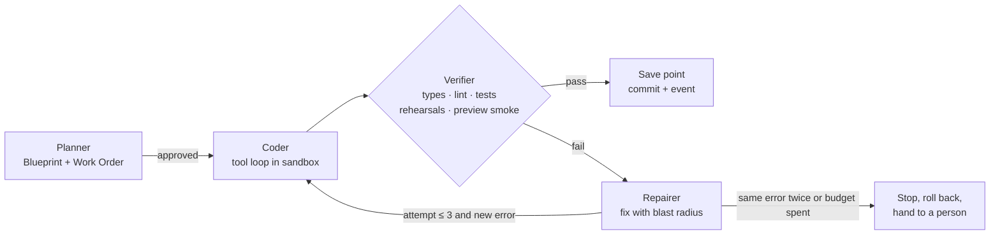
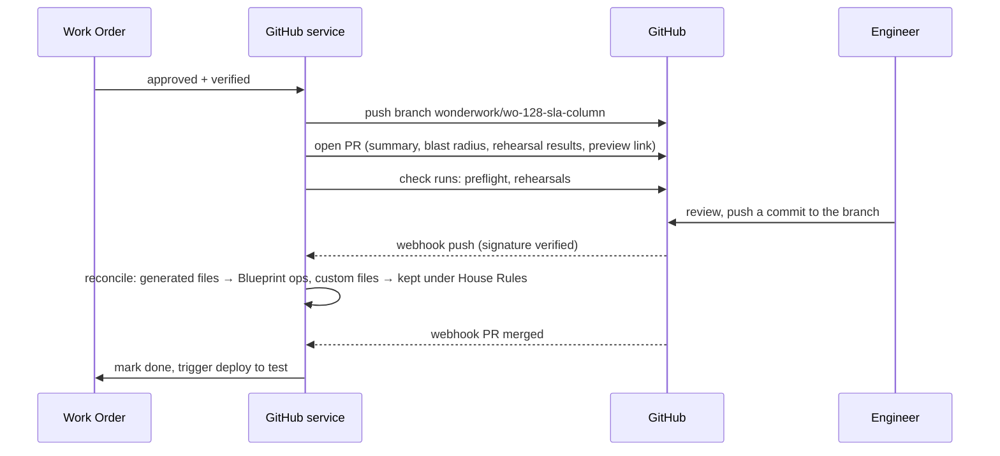

# Wonderwork: technical architecture

How Wonderwork (my prototype for Lyzr's Architect 2.0 brief) runs in production, service by service, with the reasoning behind each choice.

- Interactive version: **[architect-2-aryan.vercel.app/architecture](https://architect-2-aryan.vercel.app/architecture)**
- Diagram files: [`public/docs/architecture-diagram.png`](public/docs/architecture-diagram.png) · [`public/docs/architecture.pdf`](public/docs/architecture.pdf)
- Product decisions: [`DECISIONS.md`](DECISIONS.md) · Market research: [`RESEARCH.md`](RESEARCH.md)


**Reading the diagram.** Every service is a card and every line is a real call path. Short vertical lines join neighbours in a column (BFF → Orchestrator). Long routes run in the gutters between planes and in the two bands above and below the planes. Each plane reaches the data platform through one labelled trunk into a shared data bus, so the picture shows which plane uses which store without drawing 30 separate lines. The Orchestrator → Agent harness line also stands for the orchestrator's other activity workers (Deploy, Import, GitHub service), which pull work from Temporal task queues ([section 5](#5-communication-and-protocols)). The numbered badges match the eight steps in [section 3](#3-prompt-to-production).

---

## Contents

1. [Design principles](#1-design-principles)
2. [The planes at a glance](#2-the-planes-at-a-glance)
3. [Prompt to production](#3-prompt-to-production)
4. [Services and the reasoning behind them](#4-services-and-the-reasoning-behind-them)
5. [Communication and protocols](#5-communication-and-protocols)
6. [Sandboxing](#6-sandboxing)
7. [The agent harness](#7-the-agent-harness)
8. [Model-agnostic switching](#8-model-agnostic-switching)
9. [Frontend, sandbox and backend communication, with live preview](#9-frontend-sandbox-and-backend-communication-with-live-preview)
10. [The proxy layer](#10-the-proxy-layer)
11. [GitHub integration](#11-github-integration)
12. [Deployment](#12-deployment)
13. [Scaling to thousands of concurrent users](#13-scaling-to-thousands-of-concurrent-users)
14. [Security, tenancy and observability](#14-security-tenancy-and-observability)
15. [What the prototype runs today](#15-what-the-prototype-runs-today)
16. [Trade-offs and alternatives considered](#16-trade-offs-and-alternatives-considered)

## 1. Design principles

1. **The model decides, code does the rest.** Models produce small, structured decisions (a Blueprint, a change proposal, a tool call). Deterministic code expands, validates, renders and deploys them. This keeps output reproducible, diffable and cheap, and it is why the prototype can fall back to scripted paths without breaking.
2. **Nothing runs without a price.** Every piece of work is quoted before it starts (a Work Order) and metered after. Budgets and caps are enforced in the platform, not in a dashboard.
3. **Untrusted code never shares a kernel.** Everything a user or a model writes runs inside a per-project microVM with no secrets inside it.
4. **Every agent action passes a gateway.** In the studio and in production, tool calls go through one policy point that knows the tool's risk (Read, Change, Can't undo), can ask a person first, and records a trace.
5. **Durable by default.** Plans, builds, repairs, deploys and imports are long-running workflows that survive restarts, retries and people closing the tab.
6. **One source of truth, two faces.** The Blueprint (JSON) and the repository are kept in sync, so a person who never reads code and an engineer who never opens the studio are editing the same project.

## 2. The planes at a glance

| Plane | What lives there | Why it is separate |
|---|---|---|
| **Edge** | CDN + WAF, API gateway, preview proxy, realtime hub, app router | Global, latency sensitive, terminates TLS and WebSockets, enforces rate limits before anything expensive happens |
| **Control plane** | Web app + BFF, project service, orchestrator, agent harness, model gateway, GitHub service, deploy service, import, budget, policy | Stateless and horizontally scalable. Owns decisions, never runs user code |
| **Sandbox plane** | Sandbox manager, one Firecracker microVM per project, egress proxy | Runs untrusted code with hard isolation and its own capacity model |
| **Runtime plane** | Wonderwork Cloud (live apps), agent gateway, queues and schedules, production evals, self-hosted runtime | Serves end users with production SLOs, separate from build traffic |
| **Data + platform** | Postgres (Supabase), Redis, object storage, vector index, secrets vault, usage warehouse, observability | Shared services with their own scaling and backup policies |

## 3. Prompt to production

One request, end to end. The eight steps match the eight numbered badges on the diagram and the flow cards on the [architecture page](https://architect-2-aryan.vercel.app/architecture). Latencies are design targets.

**Step 1. Describe.**
- **Services:** Builder studio → CDN + WAF → API gateway → Web app + BFF → Project service, Budget + billing.
- **Transport:** HTTPS POST (server action) with an idempotency key; the plan streams back over SSE from the BFF.
- **Data:** the brief (a few KB of text) plus answers to three clarifying questions. The BFF creates the project row and the Work Order in `draft`.
- **User sees:** the plan appear line by line, first event in under 2 s. Nothing runs and nothing is charged until they approve.

**Step 2. Plan.**
- **Services:** BFF → Orchestrator (`PlanWorkflow`) → Agent harness (planner role) → Model gateway → Model providers. Budget + billing prices the result; Project service stores it.
- **Transport:** gRPC `StartWorkflow` over mTLS (workflow id = Work Order id, so a double click never starts two plans); Temporal task queue to the harness; gRPC stream to the model gateway; HTTPS streaming to the provider.
- **Data:** the planner returns a *decision-only* draft (about 2-4 KB of JSON). Code expands it into a full Blueprint (10-30 KB), validates every reference with zod, and computes the quote from the Blueprint (never from the model). Every model call writes a usage event (tokens, cost, latency) to the usage warehouse.
- **User sees:** the **Work Order** card: what will change, estimated time, credits, blast radius (screens, agents, files), and an Approve button. Approving places a credit hold in the ledger and sends a Temporal signal that starts `BuildWorkflow`.

**Step 3. Build in a sandbox.**
- **Services:** Orchestrator → Agent harness (coder, verifier, repairer) → Sandbox manager → Project sandbox (Firecracker microVM) → Egress proxy (package registries). Policy + approvals checks every tool call.
- **Transport:** gRPC to the sandbox manager (`Acquire`: a warm-pool VM or a snapshot resume, about 150 ms); tool calls over **vsock** to an in-VM agent, with stdout streamed back; `npm install` and `pip install` leave only through the egress proxy.
- **Data:** generated files (most are a pure function of the Blueprint), patches from the coder, test and rehearsal results as structured pass/fail. After each verified step: a git commit inside the VM, a Temporal activity result, and a save point in the Project service.
- **User sees:** the **build console**, with plain-English steps in three lanes (thought, did, checked) and a progress bar. If the verifier fails, the **repair card** ("Wonderwork caught a problem") shows what broke, the blast radius and two fixes. Fixes for our own mistakes are labelled **Our fix · free**. Picking one sends a signal and the workflow resumes.

**Step 4. Live preview.**
- **Services:** Builder studio → Preview proxy → Project sandbox dev server (`:3000`); Sandbox manager on wake.
- **Transport:** an iframe on `https://{project}.wonderwork-preview.dev`, HTTP plus the hot-reload WebSocket, routed through a Redis table `subdomain → (host, vm, port)`. The BFF mints a signed, project-scoped preview cookie.
- **Data:** HTML, JS and HMR updates from the dev server; a `postMessage` bridge maps DOM nodes to Blueprint block ids for click-to-tweak and comment pins.
- **User sees:** the app changing in place as files are written. A sleeping sandbox shows "waking up" for about a second, then the preview.

**Step 5. Show the work.**
- **Services:** in-VM file watcher and the harness → host daemon → NATS JetStream → Realtime hub → Builder studio.
- **Transport:** vsock out of the VM, NATS subjects `proj.{id}.build.*` on the host, WebSocket (SSE fallback) to the browser. Every event carries a sequence number.
- **Data:** step started, file changed, test passed, repair needed, spend so far. A reconnecting tab asks for "everything after seq N" and JetStream replays it.
- **User sees:** progress in plain English instead of a spinner, and the spend meter moving against the Work Order's ceiling.

**Step 6. Branch + PR.**
- **Services:** Agent harness → GitHub service → GitHub; webhooks come back through the API gateway to the GitHub service. Import + analysis uses the same GitHub App for existing repos.
- **Transport:** git over HTTPS and the REST API with a GitHub App installation token (expires after an hour); inbound webhooks verified with `X-Hub-Signature-256` and deduplicated by `X-GitHub-Delivery`.
- **Data:** branch `wonderwork/wo-128-sla-column`, a PR whose body is the Work Order (summary, blast radius, rehearsal results, preview link), and check runs for preflight and rehearsals. An engineer's push comes back as a webhook; generated files are parsed back into Blueprint operations, custom files are kept under House Rules.
- **User sees:** a PR link on the Work Order. An engineer's fix appears as one plain-English line in the activity feed. A conflict becomes a decision card, never a silent overwrite.

**Step 7. Ship.**
- **Services:** Builder studio → BFF → Deploy service (preflight reads Policy, Budget and the vault) → Orchestrator (`DeployWorkflow`) → Project sandbox (build) → object storage (OCI registry) → Wonderwork Cloud, Vercel, or the runtime in your VPC.
- **Transport:** HTTPS for "Go live"; gRPC between services; the Fly Machines or Knative API for Wonderwork Cloud, the Vercel REST API for Vercel, and an outbound-only mTLS tunnel for a customer VPC.
- **Data:** one immutable release (OCI image digest, static assets, migration plan, secret *references* only). Migrations use expand-and-contract, so the old release keeps working during the rollout.
- **User sees:** the **preflight** checklist (sign-in configured, keys present, irreversible tools gated, rehearsals passing, spending cap set, data region chosen). Blocking checks disable the button and name the blocker. Then a canary rollout (5% → 50% → 100%) and the **live URL** (`{app}.wonderwork.app` or a custom domain), with "Update the live version" and one-click rollback.

**Step 8. Governed agents.**
- **Services:** People using live apps → CDN + WAF → App router → Wonderwork Cloud → Agent gateway → Model gateway, Queues + schedules, Notify, Evals in production.
- **Transport:** HTTPS and WebSocket from end users; the agent gateway is a sidecar on localhost gRPC; "Ask first" approvals go out as Slack and email messages and come back as a Temporal signal.
- **Data:** each tool call with its risk level (Read, Change, Can't undo), the caller and the arguments; budget checks against the app's cap; OpenTelemetry traces and usage events. Sampled traces are replayed against the rehearsal suite on a schedule.
- **User sees:** a working app for end users. For the builder: an approvals inbox, per-app spend, agent replays and drift alerts.

## 4. Services and the reasoning behind them

Each row names a concrete choice, why, and what I rejected.

**Edge**

| Service | Responsibility | Choice | Why | Rejected |
|---|---|---|---|---|
| CDN + WAF | Static assets, TLS, bot and DDoS protection | Vercel Edge Network and Firewall for the studio; Cloudflare (CDN, managed WAF rules, bot management) for preview and live-app domains | The studio already runs on Vercel; Cloudflare in front of user traffic gives DDoS absorption and custom-hostname TLS at scale | CloudFront + AWS WAF everywhere: workable, but custom-domain TLS for thousands of customer hostnames would be ours to build |
| API gateway | Auth, per-user and per-IP rate limits, quotas, webhook ingress | Edge middleware + Redis token buckets | Rejects abuse before it reaches models or sandboxes | Rate limits inside each service: inconsistent, and abusive traffic still reaches expensive paths |
| Preview proxy | Maps a project subdomain to its sandbox dev server | Envoy (or a small Go proxy) with a Redis routing table | Handles WebSockets and hot reload, wakes sleeping sandboxes; see [section 10](#10-the-proxy-layer) | Exposing VM ports directly or a tunnel per VM: no central auth, no wake-on-request |
| Realtime hub | Streams build steps, logs, presence to the studio | NATS JetStream + a WebSocket/SSE gateway | Fan-out with replay from a sequence number, so reconnecting clients miss nothing | Supabase Realtime or Postgres `LISTEN/NOTIFY`: no replay by sequence, and it puts build chatter on the primary database |
| App router | Custom domains, TLS, routing live traffic to the right release and region | Cloudflare for SaaS custom hostnames in front of an Envoy tier; `host → (app, release, region)` in Postgres, cached in Redis | Certificates issue automatically when a customer adds a CNAME to `cname.wonderwork.app`; rollback is a pointer change in one table | A Kubernetes Ingress per app: thousands of hosts means slow config reloads and churn |

**Control plane**

| Service | Responsibility | Choice | Why | Rejected |
|---|---|---|---|---|
| Web app + BFF | Studio UI, server actions, session handling | Next.js (App Router) on Vercel | Server components give real first paint; server actions keep mutations close to the UI; the prototype already runs this way | SPA + separate REST API: two deploys and a slower first paint |
| Project service | Blueprints, save points, Work Orders, diffs, comments, handoffs | Postgres with row-level security | Save points are snapshots of JSON, so restore is instant and free; RLS keeps tenants apart even if application code has a bug | Git as the only store: slow restores, and non-technical edits would need commits |
| Orchestrator | Plan, build, repair, deploy and import workflows | Temporal (Temporal Cloud) | Durable execution with retries, timeouts, heartbeats and signals (for example "the person approved the repair") without a hand-built state machine | A queue plus a state table (see [section 16](#16-trade-offs-and-alternatives-considered)); AWS Step Functions: AWS-only and harder to test locally |
| Agent harness | Planner, coder, verifier, repairer | Stateless workers pulling Temporal activities, running one shared tool loop | One loop, four roles, explicit budgets; see [section 7](#7-the-agent-harness) | A multi-agent chat framework: harder to budget, replay and stop |
| Model gateway | One API for every model, routing, fallbacks, caching, metering | Vercel AI SDK provider registry behind an internal service | Provider-agnostic calls with typed tools and structured output; see [section 8](#8-model-agnostic-switching) | Provider SDKs called from each service: no single place for failover, caps or caching |
| GitHub service | GitHub App, branches, PRs, checks, webhooks, sync | GitHub App + webhook consumer | Fine-grained, per-repo permissions and short-lived tokens instead of personal OAuth tokens | An OAuth app with user tokens: broad scopes, long-lived credentials |
| Deploy service | Preflight, builds, releases, rollouts, rollback, custom domains | Nixpacks or Buildpacks, OCI registry, Fly Machines or Knative | Build once, promote the same artefact; rollback is a pointer switch | Rebuilding per environment: what you tested is not what you ship |
| Import + analysis | Clone, detect stack and agent frameworks, coverage map, House Rules | Runs inside a sandbox, using the GitHub App token for private repos | Reading an unknown repo is untrusted work too (install scripts, build hooks) | Analysing in the control plane: one malicious `postinstall` away from our credentials |
| Budget + billing | Quotes, holds, metering, caps, refunds | Postgres double-entry ledger + ClickHouse usage events + Stripe | Credits are a ledger, so refunds for "our fix" are exact and auditable | Stripe as the balance of record: too slow and coarse for per-call caps |
| Policy + approvals | Tool permissions, House Rules, approval inbox, audit log | Policies in Postgres, compiled into bundles evaluated in-process by the harness and the agent gateway | One place to answer "who allowed this agent to do that", with sub-millisecond checks on every call | OPA or Cedar as a network service: an extra hop on every tool call for three risk levels plus path rules |

**Sandbox plane**

| Service | Responsibility | Choice | Why | Rejected |
|---|---|---|---|---|
| Sandbox manager | Creates, snapshots, suspends, resumes microVMs; warm pools | Firecracker on bare-metal hosts (E2B as burst capacity) | Strong isolation with about 150 ms resume; see [section 6](#6-sandboxing) | Kubernetes pods: a shared kernel between tenants |
| Project sandbox | Dev server, agent runtime, tests, language servers | One Firecracker microVM per project, persistent volume, in-VM agent on vsock | Real ports, Python and Node, state that survives between prompts | Browser WebContainers: Node only, no long-running Python agents |
| Egress proxy | All outbound traffic from sandboxes; secret injection | Envoy per sandbox host; nftables on each VM's tap device forces traffic through it | L7 allow-list by hostname, and real secrets are swapped in on the way out so they never enter the VM | IP allow-lists only: cannot filter by hostname or inject secrets; secrets as env vars in the VM: readable by any generated code |

**Runtime plane**

| Service | Responsibility | Choice | Why | Rejected |
|---|---|---|---|---|
| Wonderwork Cloud | Hosts live apps with scale to zero | Fly Machines at launch; Knative on our own Kubernetes for enterprise regions; a Neon Postgres branch per app | Sub-second machine starts, scale to zero, and per-app databases that branch like git for test versions | AWS Lambda: 15-minute limit and no long-lived WebSockets for agent tasks |
| Agent gateway | Enforces permissions and approvals for live agents, meters their model use | Sidecar next to each app, talking to the app on localhost | The product promise ("anything that can't be undone asks a person") has to hold in production, not just in the studio | Checks inside generated agent code: an engineer can edit them away |
| Queues + schedules | Triggers, retries, long-running and scheduled agent tasks | Temporal task queues and Schedules (a namespace per cell); NATS JetStream for event triggers | Agent tasks can wait days for an approval and survive restarts; one engine for studio and runtime workflows | Cron in the app container: lost when the app scales to zero; SQS alone: no durable waiting for a person |
| Evals in production | Replays rehearsals on real traces, alerts on drift | Scheduled Temporal jobs that sample traces (every "Ask first" call plus 5% of the rest), run the rehearsal suite with deterministic checks and an LLM judge, and write scores to ClickHouse | Catches drift from real inputs and silent model updates; the same suite gates model switches ([section 8](#8-model-agnostic-switching)) | Pre-launch evals only: miss what real users actually send |
| Your VPC or on-prem | The same runtime in the customer's network | Helm chart (runtime, agent gateway, OpenTelemetry collector) plus a Terraform module for EKS, GKE or AKS; an outbound-only mTLS tunnel to our control plane | Data, traces and model calls stay in the customer's network; security teams approve outbound 443 far more easily than inbound access | Shipping the whole control plane on-prem: every upgrade becomes a customer project; an inbound VPN: usually a security-review blocker |

**Data + platform**

| Store | Holds | Choice | Why | Rejected |
|---|---|---|---|---|
| Postgres | Users, projects, Blueprints, Work Orders, ledger, events, audit | Supabase Postgres per region, RLS on every table, Supavisor pooling, point-in-time recovery | Already the prototype's database; RLS is the second wall between tenants | DynamoDB: no joins or RLS, and the Blueprint model is relational |
| Redis | Rate-limit buckets, preview and app routing tables, locks, session cache | Managed Valkey/Redis per region (ElastiCache) | Atomic Lua scripts for token buckets, microsecond lookups on the preview path | Rate limiting in Postgres: write amplification at thousands of requests a second |
| Object storage | Sandbox snapshots, build artefacts, OCI images, repo archives | S3 with versioning, lifecycle rules and same-jurisdiction replication; the registry stores its layers here | Snapshots must outlive any host so a VM can resume anywhere | Snapshots on host disks only: lost with the host and pins VMs to one machine |
| Vector index | Repo maps, framework docs, agent knowledge | pgvector (HNSW) in the regional Postgres | Same RLS, backups and region as the rest of the data; no second system to keep in sync | A dedicated vector database: another tenant boundary to secure, not needed at this scale |
| Secrets vault | Connection keys, BYOK model keys, platform credentials | AWS KMS envelope encryption: per-tenant data keys, ciphertext in Postgres; AWS Secrets Manager for platform secrets | Decryption happens only in the egress proxy and the runtime injector, and every decrypt is logged | A single platform-wide key: one leak exposes every tenant |
| Usage warehouse | Tokens, credits, sandbox minutes, trace summaries | ClickHouse Cloud, batch-ingested from NATS JetStream | Fast aggregates for spend meters and cost dashboards without scanning Postgres | Analytics on Postgres: large scans compete with the studio's writes |
| Observability | Traces, metrics, logs, LLM spans, SLOs | OpenTelemetry collectors → Grafana Tempo, Mimir and Loki; Sentry for browser errors | One trace from a click to a sandbox command; open formats avoid lock-in | Per-host-priced APM: cost grows with thousands of sandboxes |
| Notify | Slack and email for approvals and handoffs | A small service subscribed to `approvals.*` and `handoffs.*` on NATS; Slack app + transactional email | Approvals reach people where they already work; Slack button clicks come back signed | Email only: approvals sit unread and agents wait |

## 5. Communication and protocols

Rules that apply to every row: service-to-service traffic is mTLS with workload identities; the end user's identity travels with each request, so Postgres RLS applies to service calls too; every mutating call carries an idempotency key; every hop propagates a W3C `traceparent`.

| From → to | Transport | Sync or async | Auth | Why |
|---|---|---|---|---|
| Studio → API gateway → BFF (commands: approve, tweak, restore, go live) | HTTPS (HTTP/2), server actions and JSON | Sync | Supabase session cookie (HttpOnly), JWT verified at the gateway | Idempotent commands keyed by a client request id, safe to retry |
| BFF → Studio (planning, agent chat) | SSE over HTTPS (AI SDK UI message stream) | Async stream | Same session | One-way token stream that survives proxies; the prototype does this today |
| Realtime hub → Studio (build, deploy, logs, presence) | WebSocket, SSE fallback; every message has a `seq` | Async stream | 5-minute JWT scoped to one project, minted by the BFF | A reconnecting tab resumes from its last `seq`; JetStream replays the gap |
| Studio → Preview proxy → sandbox dev server | HTTPS + WebSocket upgrade (HMR) on `*.wonderwork-preview.dev`; plain HTTP on the host's private network to the VM | Sync | Signed, project-scoped preview cookie checked at the proxy; the VM sees no credentials | Separate registrable domain, so preview code cannot read studio cookies |
| BFF → Orchestrator | gRPC (Temporal SDK): start, signal, query | Sync call, async workflow | mTLS, one Temporal namespace per cell | Durable workflows; approvals arrive as signals |
| BFF → Project service, Budget, Policy | gRPC (Connect) | Sync | mTLS + the user's JWT forwarded, so RLS applies | Typed contracts; the database enforces tenancy even if a service has a bug |
| Orchestrator → Agent harness, Deploy, Import, GitHub service | Temporal task queues (activities with heartbeats) | Async | mTLS | Workers pull work, so scaling means adding workers; a dead worker is detected by a missed heartbeat |
| Agent harness → Model gateway | gRPC server stream | Sync, streamed | mTLS + a budget token for the Work Order | Every call is routed, priced and capped in one place |
| Model gateway → Model providers | HTTPS provider APIs with SSE streaming | Sync, streamed | Platform keys from the vault, or the customer's BYOK key; fixed egress IPs for private endpoints | Providers only speak HTTPS; fixed IPs let customers allow-list us |
| Agent harness → Sandbox manager | gRPC: acquire, snapshot, suspend, resume | Sync | mTLS | Lifecycle calls are short and must fail fast |
| Agent harness → in-VM agent | **vsock** (Firecracker virtio-vsock, host side is a Unix socket) carrying gRPC: `fs.patch`, `shell.run`, `test.run` | Sync request, streamed output | Per-VM token injected at boot; reachable only from the host | Needs no guest networking, so nothing on the internet or in another VM can reach the agent |
| Sandbox → Realtime hub | vsock to the host daemon → NATS JetStream subjects `proj.{id}.build.*` | Async | The host daemon holds a per-project NATS credential; the VM holds none | Events leave the VM without giving it credentials |
| Sandbox → Egress proxy → internet | All traffic forced through Envoy by nftables; SNI allow-list, TLS terminated only for declared connections (the VM trusts a per-project CA) so placeholders can be swapped for real keys | Sync | Per-project allow-list and secrets | Registries and declared APIs work; secrets never enter the VM |
| GitHub → GitHub service (webhooks) | HTTPS POST via the API gateway | Async: ack within GitHub's 10-second window, then a workflow does the work | `X-Hub-Signature-256` HMAC, deduplicated by `X-GitHub-Delivery` | Pushes from engineers must never be processed twice or dropped |
| GitHub service → GitHub | git over HTTPS, REST and GraphQL | Sync | GitHub App installation token (expires after 1 hour); the app's JWT is signed inside KMS | No stored personal tokens; the App private key never leaves KMS |
| Stripe → Budget + billing (webhooks) | HTTPS POST via the API gateway | Async | `Stripe-Signature` (timestamped HMAC, 5-minute tolerance), deduplicated by event id | Payment state changes are applied exactly once |
| Budget + billing → Stripe | HTTPS API: meter events, invoices | Async, batched | Restricted API key; `Idempotency-Key` on every write | Usage is metered continuously without double charges |
| Deploy service → Wonderwork Cloud, Vercel, your VPC | Fly Machines or Knative API; Vercel REST API; commands down an outbound-only mTLS tunnel (gRPC bidirectional stream) | Async (deploy workflow) | Platform API token; the customer's Vercel integration token; per-cluster tunnel certificate | Same release, three targets; the VPC never accepts inbound connections |
| End users → App router → Wonderwork Cloud | HTTPS and WebSocket | Sync | The app's own sign-in | Standard web traffic, routed by host name to the current release |
| Live app → Agent gateway → Model gateway, tools | localhost gRPC to the sidecar, then mTLS | Sync; "Ask first" waits on a Temporal signal | Workload identity per app | Every production tool call is checked, metered and traced |
| Agent gateway, Policy → Notify → Slack, email | NATS `approvals.*` → Slack Web API and email | Async | Slack bot token from the vault; button clicks come back with Slack's signing secret | People approve where they already work |
| Every service → Observability, Usage warehouse | OTLP/gRPC to a node-local collector; NATS `usage.*` batched into ClickHouse | Async, batched | mTLS | Telemetry never blocks a request |

## 6. Sandboxing

**Choice: one Firecracker microVM per project**, with gVisor containers as a fallback for small, stateless jobs.

| Option | Isolation | Start | Verdict |
|---|---|---|---|
| Firecracker microVM | Own guest kernel, KVM boundary | ~125 ms cold boot, ~150 ms snapshot resume | **Chosen.** Strong multi-tenant boundary, runs Python and Node agents, real ports, persistent disk |
| gVisor container | User-space kernel intercepts syscalls | ~1 s | Fallback for short analysis jobs; some I/O overhead |
| Plain Docker | Shared host kernel | ~1 s | Rejected. One container escape reaches every tenant |
| Browser WebContainers | Browser tab | Instant | Rejected. Node only, so no LangGraph, CrewAI or Google ADK agents in Python, and no long-running jobs |

**Why a VM per project, not per request.** Agentic apps need a dev server, package caches, a language server and a Python environment that persist between prompts. Recreating those per request costs minutes; resuming a snapshot costs milliseconds.

**Lifecycle.**

1. *Create*: the manager takes a VM from a **warm pool** of pre-booted images per stack (Next.js + Python, Vite + Node), attaches the project's persistent volume and injects a short-lived identity token.
2. *Run*: 2 vCPU and 4 GB by default, CPU overcommitted about 4:1 because most time is spent waiting for models. Hard limits on memory, disk, processes and wall-clock per command.
3. *Suspend*: after 10 idle minutes the VM is snapshotted (memory + disk diff) to local NVMe and to object storage, then released.
4. *Resume*: a preview request or a new Work Order restores the snapshot on any host in about 150 ms (warm host) to 2 s (cold fetch).
5. *Destroy*: projects idle for 14 days keep only the disk image and git history.

**Security.**

- **No secrets inside the VM.** Code sees placeholders such as `WONDERWORK_SECRET_stripe`. The egress proxy swaps the real value in on the way out, only for hosts that connection is allowed to call.
- **Egress allow-list** per project: package registries, the declared connections, the model gateway. The cloud metadata endpoint and private ranges are blocked.
- Per-VM network namespace, seccomp-filtered jailer, read-only base image, no host mounts. The in-VM agent is reachable only over vsock from the host.
- Abuse controls: CPU-pattern detection for crypto mining, outbound rate limits, per-tenant quotas.

## 7. The agent harness

The harness turns a request into verified changes. It has four roles that share one tool loop:



**Planning.** The planner produces a *decision-only* draft: data, connections, agents with their tools and risk, screens and their purpose. Code expands it into a full Blueprint (JSON, validated with zod) and checks every reference: a table column must exist on its entity, a tool must point at a declared connection. The estimate is always recomputed by code, never trusted from the model. This is exactly what the prototype does today (`lib/llm/draft.ts`, `lib/llm/expand.ts`, `lib/blueprint/validate.ts`).

**Code generation.** Most files are a pure function of the Blueprint (`lib/codegen/*`): routes, blocks, schema, agent files in six frameworks. The model writes only what the Blueprint cannot express (custom logic, integrations), inside files the Blueprint marks as custom. This keeps diffs small and makes the Blueprint and the repo two views of one project.

**Tools available in the loop.** Every call is checked against Policy + approvals before it runs.

| Tool | Purpose | Guardrail |
|---|---|---|
| `fs.read`, `fs.patch`, `fs.write` | Edit files | House Rules path filters ("never touch /legacy") |
| `shell.run` | Install, build, run scripts | Timeout, output cap, no network except allow-list |
| `test.run`, `rehearse.run` | Unit tests and agent rehearsals | Results parsed into structured pass/fail |
| `preview.check` | Headless browser loads the preview, returns console errors and a screenshot | Runs against the sandbox only |
| `repo.search`, `repo.map` | Symbol search over a tree-sitter repo map | Keeps context small |
| `docs.lookup` | Framework docs from the vector index | Versioned to the project's dependencies |
| `git.commit` | Commit to the Work Order branch | Only after the verifier passes |

**Context management.** The Blueprint is the long-term memory (a few KB, always in context). The repo map gives symbols, not whole files. Each step gets a token budget; older turns are summarised; large tool outputs are stored as artefacts and referenced by id.

**Error recovery.**

- *Transient* (429, 5xx, timeouts): retried by the orchestrator with backoff, then failed over to another provider by the model gateway.
- *Invalid output* (schema mismatch): near-miss JSON is repaired locally (nulls, synonyms, casing); otherwise the model is re-asked once with the exact validation error, then the step falls back to a rule-based path. The prototype does exactly this for change requests (`lib/change/edits.ts`, `lib/change/propose.ts`).
- *Build or test failure*: the repairer proposes a fix with its blast radius (screens, agents, files). In the product this is the "Wonderwork caught a problem" card, and the fix is labelled **Our fix · free**.
- *Doom loops*: errors are normalised (paths, line numbers and ids stripped) and hashed. The same signature twice, or three attempts, stops the loop, restores the last save point and opens a handoff with the full context.
- *Crashed workers or hosts*: each verified step is a Temporal activity result plus a git commit, so a new worker resumes from the last completed step on a restored snapshot.
- *People stop runs*: a stop signal cancels the workflow; unused credits are refunded by the ledger.

**Budgets.** Each Work Order carries a ceiling on credits, steps and wall-clock time. The harness checks the ceiling before every model call and every tool call.

## 8. Model-agnostic switching

All model traffic goes through the **model gateway**. Callers ask for a *task*, not a model:

```ts
gateway.generate({ task: "plan", schema: DraftSchema, prompt, budget })
gateway.stream({ task: "agent-chat", tools, toolApproval, messages })
```

- **Provider registry.** Anthropic, OpenAI, Google, and open models served by vLLM, Bedrock, Vertex or Groq, all behind the Vercel AI SDK interface. The prototype already isolates this behind one `getModel()` seam (`lib/llm/provider.ts`), so adding providers is configuration.
- **Capability matrix.** For each model: tool calling, structured output mode, context window, vision, price per million tokens, p50/p95 latency. Routing refuses a model that lacks a capability the task needs.
- **Routing policy per task.** Planning and repair use a frontier model (for example Claude Opus 5). Code edits use a strong mid-tier model. Summaries, classification and naming use a small model. Embeddings use a dedicated model.
- **Failover chain.** On rate limits or outages, the gateway retries with the next model in the chain that satisfies the task's capabilities, and records the switch in the trace.
- **Customer control.** Workspaces can bring their own keys, pin a provider for data-residency reasons, or point at a private endpoint (Bedrock, Azure OpenAI, a self-hosted vLLM cluster).
- **Prompt adapters.** Per model family, not per call site: system-prompt placement, tool schema dialect, JSON mode.
- **Eval-gated switches.** A model can only become the default for a task after it passes the golden rehearsal suite for that task (plan validity, repair success, agent safety). No silent regressions.
- **Metering and caching.** Every call records tokens, cost and latency against the project and the person (the prototype does this today in `lib/llm/pricing.ts` and `usage_events`). Prompt caching is on by default for the long, stable prefix (instructions + Blueprint).

## 9. Frontend, sandbox and backend communication, with live preview

The full protocol table is in [section 5](#5-communication-and-protocols). The build path looks like this:


- **Commands** (approve, tweak, restore, go live) are HTTPS calls to server actions or the API. They are idempotent, keyed by a client request id.
- **Streams**: planning and agent chat stream over SSE directly from the BFF (the prototype does this for planning and the agent playground). Build and deploy progress stream through the realtime hub, which assigns sequence numbers so a reconnecting client resumes from the last event it saw.
- **Live preview** is an iframe pointed at the project's preview subdomain. The dev server in the VM serves it, the preview proxy carries both HTTP and the hot-reload WebSocket, and a small injected bridge script maps DOM nodes to Blueprint block ids over `postMessage`. That bridge powers click-to-tweak and comment pins, which in the prototype are implemented against the spec renderer.
- **Terminal and logs** for engineers use a PTY over WebSocket through the same hub, gated by project role.
- **Your editor**: engineers work on the same GitHub repo, or run `npx @wonderwork/cli sync --watch` to push local edits into the sandbox; both paths end in the same reconcile step as a webhook.

## 10. The proxy layer

There are three proxies, each with one job.

**Preview proxy (inbound to sandboxes).**

- Wildcard DNS and TLS for `*.wonderwork-preview.dev`, a **separate registrable domain** from the studio (and from live apps on `wonderwork.app`) so preview code can never read studio cookies.
- Routing table in Redis: `subdomain → (host, vm id, port)`, updated by the sandbox manager on every resume.
- Access control: a short-lived signed cookie scoped to one project, minted by the BFF when the studio loads the preview. Shared preview links carry their own expiring token.
- WebSocket upgrades pass through for HMR.
- **Wake on request**: if the VM is suspended, the proxy holds the request, asks the manager to resume, and streams a "waking up" page if resume takes longer than a second.
- Per-project rate limits and request size limits; strict CSP and `frame-ancestors` so previews only embed in the studio.

**Egress proxy (outbound from sandboxes).** Sits on every sandbox host. nftables rules on each VM's tap device send all traffic to it, so code cannot bypass it. Hostname allow-list per project (from SNI), secret injection by placeholder ([section 6](#6-sandboxing)) for declared connections only, request logging, metadata endpoint and private-range blocking.

**Agent gateway (runtime, for live agents).** Every tool call from a production agent is checked against its permission (Read, Change, Can't undo) and its supervision level. "Ask first" tools create an approval request (web, Slack or email) and the workflow waits on a signal. Model calls from live agents are routed through the model gateway so they count against the app's budget cap. Every call produces a trace for replay and for production evals.

## 11. GitHub integration



- **GitHub App**, installed per repository, with short-lived installation tokens (one hour). No personal access tokens stored. The App's private key lives in KMS and signs the App JWT there.
- **Connect or create**: a new project can create a repo; an existing repo is imported through the import pipeline (clone into a sandbox, detect stack and agent frameworks, coverage map, House Rules). The prototype's import runs these reads and detections for real against public repos (`lib/import/*`).
- **Branch per Work Order**, commits authored by the app with the person as co-author, PR body generated from the Work Order.
- **Two-way sync**: pushes from engineers arrive by webhook. Files that are generated from the Blueprint (for example `agents/*/agent.yaml`, `RULES.md`) are parsed back into Blueprint operations; everything else stays as custom code. Conflicts become a decision card in the studio, never a silent overwrite.
- Protected `main`; merge triggers deploy to the test environment; the Ship tab promotes to live.
- Webhooks are verified, deduplicated by delivery id and processed in an idempotent workflow.

## 12. Deployment

**User apps.**

1. **Preflight** (the prototype's Ship tab): sign-in configured, keys present, irreversible tools gated, rehearsals passing, spending cap set, data region chosen. Blocking checks disable the button and name the blocker.
2. **Build once**: Nixpacks or Buildpacks inside the sandbox produce an OCI image plus static assets; the release id is immutable.
3. **Targets**:
   - *Wonderwork Cloud*: Fly Machines (or Knative) with scale to zero, a Postgres branch per app (Neon), secrets from the vault, the agent gateway as a sidecar, custom domains with automatic TLS.
   - *Vercel*: deploy through the Vercel API into the customer's team, env vars synced.
   - *Customer VPC or on-prem*: Helm chart or Terraform module for the runtime and agent gateway, connected to the control plane through an outbound-only tunnel. Data and traces stay in the customer's network.
4. **Rollout**: canary 5% → 50% → 100% with automatic rollback on error rate or latency SLO breach.
5. **Rollback** is instant: the router points at the previous release. Database migrations use expand-and-contract so old releases keep working.

**Wonderwork itself.**

*Infrastructure as code.* Terraform (OpenTofu-compatible) in an `infra/` monorepo. Every managed service in this design (Temporal Cloud, Supabase, ClickHouse Cloud, Cloudflare, Vercel, Grafana) ships an official Terraform provider, and a `plan` diff is easy to review in a PR. I rejected Pulumi: general-purpose languages add little for infrastructure that is mostly declarative.

| Module | Creates |
|---|---|
| `network` | VPC, private subnets, NAT gateways with static egress IPs, PrivateLink endpoints |
| `eks` | Control-plane cluster, node pools (system, services, NATS), Karpenter autoscaling |
| `sandbox_fleet` | Bare-metal groups for Firecracker (for example `m7i.metal-24xl`: 96 vCPU, 384 GiB, matching the capacity model), host daemon and egress proxy images |
| `data` | Supabase project, ElastiCache, S3 buckets with lifecycle and replication, KMS keys |
| `temporal` | Temporal Cloud namespaces, one per cell |
| `clickhouse`, `observability` | ClickHouse Cloud service; Grafana stack, alert rules, SLO dashboards |
| `edge` | Cloudflare zones, WAF rules, custom-hostname setup; Vercel project and domains |
| `cell` | Composes the modules above into one cell; a region is a list of cells |

Kubernetes workloads ship as Helm charts, deployed by Argo CD ApplicationSets (one Application per cell).

*Environments.* Separate cloud accounts, GitHub Apps and Stripe modes per environment.
- **dev**: a Vercel preview deployment per PR and a shared dev cluster with a namespace per branch.
- **staging**: production-shaped, one region, Stripe test mode, synthetic studio journeys running around the clock.
- **prod**: US, EU and India regions, each split into cells.

*Region strategy.* Each region is a full, independent stack: control plane, sandbox fleet, runtime and data. A thin global layer holds only the tenant directory (which region a workspace lives in), billing roll-ups and the marketing site. A workspace is pinned to its home region at signup for data residency; the edge reads a region claim in the JWT and sends requests there. Model calls use in-region endpoints (Bedrock or Vertex) where residency is required. Each region has a warm-standby pair in the same jurisdiction (for example us-east-1 with us-west-2, eu-central-1 with eu-west-1, ap-south-1 with ap-south-2).

*CI/CD for the platform.* Today the repo's CI (`.github/workflows/ci.yml`) runs typecheck, lint, fixture checks and a production build on every push and pull request. The Playwright smoke suite (`npm run test:e2e`) runs separately against a local server or the live URL (`BASE_URL`). The production pipeline adds:
1. Unit tests, Playwright against the PR's preview deployment, and `terraform plan` posted to the PR with policy checks (Checkov).
2. Container builds with an SBOM, a Trivy scan and cosign signatures; only signed images are admitted to clusters.
3. Merge → Argo CD syncs staging → the golden rehearsal suite and synthetic journeys must pass.
4. Production rolls out **cell by cell**: one canary cell, then 25%, then all, with automatic rollback on SLO burn. Product changes ship dark behind feature flags; migrations run as a separate expand-and-contract step.
5. CI assumes cloud roles through GitHub OIDC; no long-lived cloud keys exist in CI. Sandbox base images rebuild weekly and on any critical CVE, and roll into warm pools gradually.

*Secrets and key management.*
- One KMS key per region per environment. Each tenant has a data key (AES-256-GCM), wrapped by the regional KMS key. User secrets (connection keys, BYOK model keys) are stored as ciphertext plus the wrapped data key in Postgres.
- Decrypt calls carry an encryption context of `{tenant_id, secret_id}`, so a ciphertext copied to another tenant will not decrypt. Only the egress proxy and the runtime secret injector hold decrypt permission, and every decrypt lands in the audit trail (CloudTrail).
- Rotation: KMS keys rotate yearly; data keys can be re-wrapped at any time without re-encrypting secrets. Deleting a tenant's data key crypto-shreds every secret it protected.
- Enterprise workspaces can bring their own KMS key through a cross-account grant, and revoke it.
- Platform secrets live in AWS Secrets Manager and reach pods through External Secrets Operator.

*Backups and disaster recovery.*

| Component | Backup | RPO | RTO |
|---|---|---|---|
| Postgres (projects, ledger, audit) | Point-in-time recovery plus a nightly logical dump copied to the standby region | 5 min | 1 h (regional failover) |
| Temporal workflows | Temporal Cloud namespace replicated to the standby region | Seconds (replication lag) | 15 min |
| Object storage (snapshots, releases) | S3 versioning plus replication with Replication Time Control (15-minute replication target) | 15 min | 1 h |
| Usage warehouse | Daily ClickHouse backups to S3; JetStream keeps 7 days of `usage.*` for replay. The ledger in Postgres, not ClickHouse, is the record for money | 24 h (rebuilt by replay) | 4 h |
| Redis | None needed: routing tables are rebuilt from the manager and Postgres | n/a | 5 min |
| Live apps | Stateless machines; per-app Neon branches with point-in-time recovery | 5 min | 30 min |
| A sandbox host | Snapshots in S3; the harness resumes from the last committed step | ≤ 10 min of in-flight work | Minutes (resume elsewhere) |

Restores are tested monthly and failover is rehearsed in a quarterly game day.

*Observability.*
- **Traces:** OpenTelemetry from the browser click through the BFF, Temporal (trace context in workflow headers), the harness, the model gateway and into the VM over vsock. LLM calls are spans with model, tokens and cost attributes.
- **Metrics:** request rate, errors and duration per service. Plus sandbox pool depth, resume p95, host memory, tokens per minute per provider, 429 rate, failover count, prompt-cache hit rate and queue depth.
- **Logs:** structured JSON tagged with tenant, project and Work Order ids, with PII redacted at the collector.
- **SLOs** (see [section 13](#13-scaling-to-thousands-of-concurrent-users)) use multi-window burn-rate alerts. 2% of the monthly error budget burned in 1 hour pages someone; 10% in 3 days opens a ticket.

*Cost controls.*
- **Models** are the largest line. Levers: deterministic codegen for most files, prompt caching of the stable prefix, task routing to cheaper models, and per-tenant caps enforced in the gateway rather than reported after the fact. Provider-level spend alarms fire on anomalies.
- **Sandboxes:** idle suspend after 10 minutes, 4:1 CPU overcommit and bin-packing by memory. At 25% memory headroom one 384 GiB host holds about 72 awake sandboxes: roughly 7 cents per awake sandbox-hour at on-demand prices before savings plans. The baseline fleet runs on savings plans; bursts go to E2B. Spot capacity is used for CI and eval batches, never for sandboxes, because an interruption loses in-memory state.
- **Storage:** S3 Intelligent-Tiering for snapshots, with lifecycle deletion after 14 idle days (the disk image and git history are kept).
- **Showback:** daily cost per tenant (tokens, sandbox minutes, storage) from the usage warehouse, compared with revenue. An alert fires when a tenant's gross margin falls below target. AWS Budgets and Cost Anomaly Detection cover each environment.

## 13. Scaling to thousands of concurrent users

**Capacity model** for 5,000 people in the studio at the same time:

| Resource | Assumption | Estimate |
|---|---|---|
| Awake sandboxes | ~30% of people have work running, the rest are snapshotted | ~1,500 microVMs |
| Sandbox hosts | 4 GB each, memory bound, 384 GB per host, 25% headroom | ~20 bare-metal hosts per region at peak |
| Model traffic | ~20% actively generating, ~2 calls a minute, ~8k input and ~1k output tokens per call | ~16M input and ~2M output tokens a minute, about 70% of input served from prompt cache |
| Realtime | One connection per open studio | 5,000 connections; one NATS cluster with WebSocket gateways handles 100k+ |
| Database writes | ~1 build event per second per active build, batched | ~1,000 writes a second, well within one Postgres primary |

**How each bottleneck is handled.**

- **Control plane**: stateless pods autoscale on CPU and queue depth. Long work lives in Temporal, so scaling down never kills a build.
- **Sandboxes**: warm pools per stack, bin-packing by memory, idle suspend after 10 minutes, per-tenant concurrency quotas, burst to a managed provider when the fleet is full.
- **Models**: the gateway keeps token buckets per provider, key and region, queues by priority (a person waiting beats a background eval), fails over between providers, and uses provisioned throughput for the planner tier. Cheaper models take low-risk steps.
- **Cells**: tenants are sharded into cells of about 1,000 active users, each with its own sandbox pool, queues and Temporal namespace. A bad deploy or a noisy tenant affects one cell, not everyone.
- **Database**: connection pooling (Supavisor), read replicas for dashboards, monthly partitions for events and usage, usage analytics in ClickHouse rather than Postgres.
- **Cost**: budgets and caps per person and per app, prompt caching, deterministic codegen for most files, and snapshots instead of idle machines.

**SLOs**: studio actions p95 under 300 ms, first plan event under 2 s, sandbox resume p95 under 1 s, preview availability 99.9%, live apps 99.95%.

## 14. Security, tenancy and observability

- **Tenancy**: row-level security on every table (in the prototype today), per-tenant encryption keys for secrets, per-project sandboxes and networks.
- **Identity**: Supabase Auth with Google, email and guest sessions that can be upgraded without losing work (real today); SAML SSO and SCIM for enterprise.
- **Audit**: every approval, permission change, deploy and rollback is an append-only audit event, visible in the studio's activity feed.
- **Observability**: OpenTelemetry traces from the browser action through the workflow, each model call (tokens, cost, latency) and each sandbox command. Per-project cost dashboards come from the usage warehouse. Agent replays in the product are built from the same traces.

## 15. What the prototype runs today

| Part | In the live prototype | In production |
|---|---|---|
| Studio, auth, data | **Real.** Next.js 16 on Vercel, Supabase Auth (Google, email, guest sessions you can keep), Postgres with RLS on every table | Adds SAML SSO, SCIM, regions |
| Planner | **Real.** Claude plans a structured draft, streamed live; code expands and validates it; starter plans when no model is available | Same contract, through the model gateway |
| Model gateway | **Real, single provider.** `getModel()` seam, env-based switch, per-call token and cost metering, daily budgets per person | Multi-provider routing, failover, BYOK, caching |
| Change requests | **Real.** Claude returns typed edits (fields, columns, permissions, rules, rehearsals, screens, theme); code resolves names, fills sample data and emits validated operations; one self-repair retry with the exact error; questions get answers instead of changes; priced Work Order; save point | Same, executed by the harness in a sandbox |
| Agent playground + approvals | **Real.** Agents run on Claude with tools; "Ask first" tools pause for a person (AI SDK tool approval) | Same policy enforced by the agent gateway in production |
| Build + repair | **Simulated, labelled.** Deterministic build timeline; the repair decision is real and changes the Blueprint | Full tool loop in microVMs |
| Sandbox + live preview | **Simulated, labelled.** Preview renders the Blueprint with a spec renderer; no untrusted code runs | Firecracker microVMs behind the preview proxy |
| GitHub | **Partly real.** Public repo reads, stack and agent detection, House Rules; pushes and PRs are sandboxed | GitHub App with two-way sync |
| Deploy | **Real for Wonderwork Cloud.** Public `/live/…` URL served from a published snapshot, with rollback; Vercel and VPC are sandboxed | Immutable releases, canary, instant rollback |

## 16. Trade-offs and alternatives considered

- **Build vs buy sandboxes.** E2B, Daytona and Modal would get us to market faster; we start with E2B for burst capacity and run our own Firecracker fleet for cost and control at steady state.
- **Temporal vs a queue.** A plain queue plus a state table is simpler on day one, but builds with human approvals in the middle are exactly what durable workflows are for.
- **Blueprint-first vs code-first.** Code-first (like IDE agents) is more flexible; Blueprint-first is what lets non-technical people review a plan, price it and roll it back. We keep both by syncing them, and by letting custom code live outside the Blueprint under House Rules.
- **One repo per project.** Simpler permissions and a clean handoff to engineers; monorepo support comes through the import pipeline and House Rules.
- **Multi-framework agents.** We compile one agent definition into six frameworks (Lyzr ADK, LangGraph, CrewAI, OpenAI Agents SDK, Google ADK, Mastra) and list what does not translate, instead of pretending the frameworks are equivalent.
- **Regional cells vs one global control plane.** Cells cost more to operate (N copies of everything), but they give data residency, a small blast radius and a clean unit for capacity planning.
