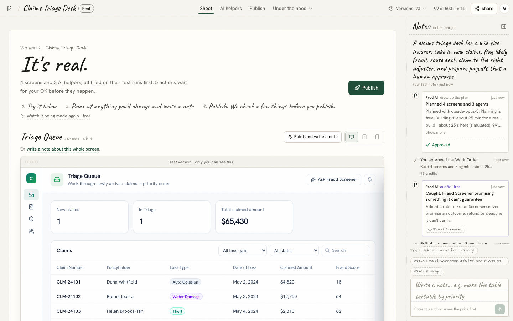
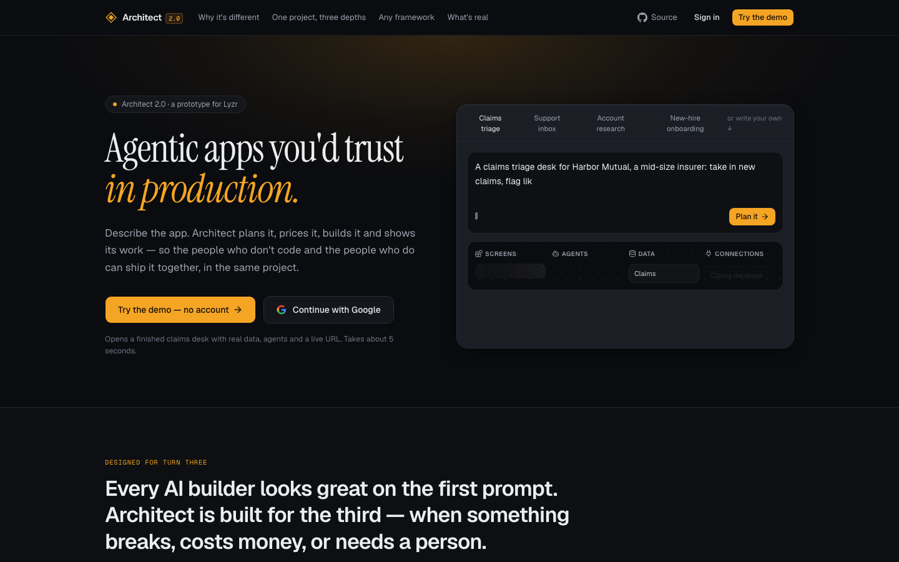
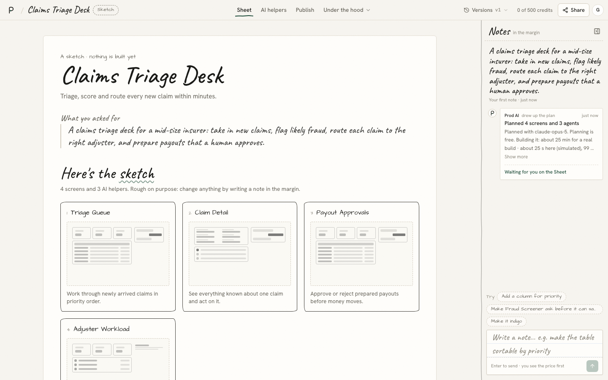
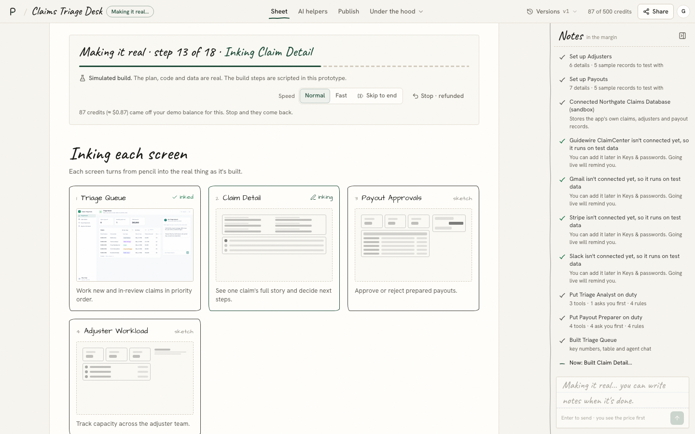
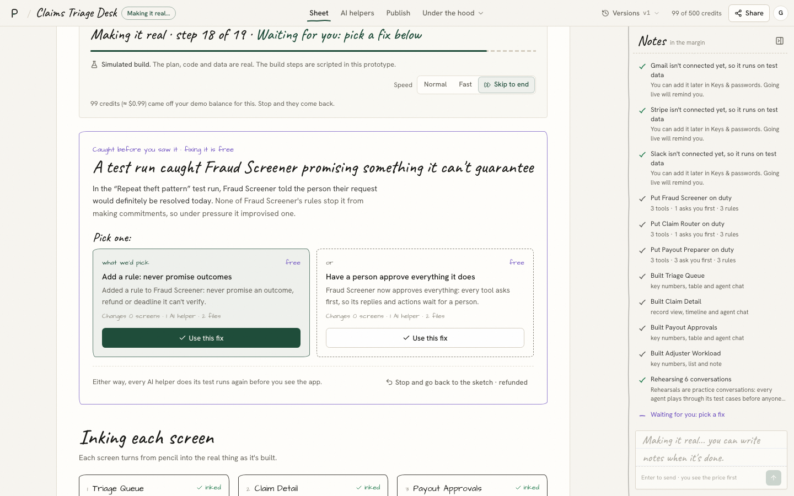
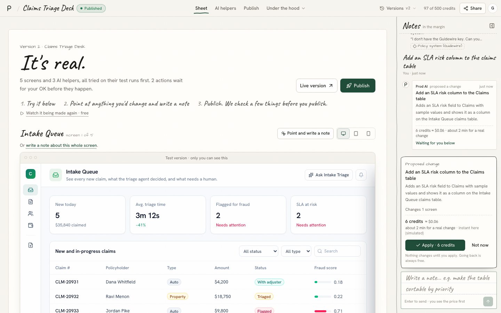
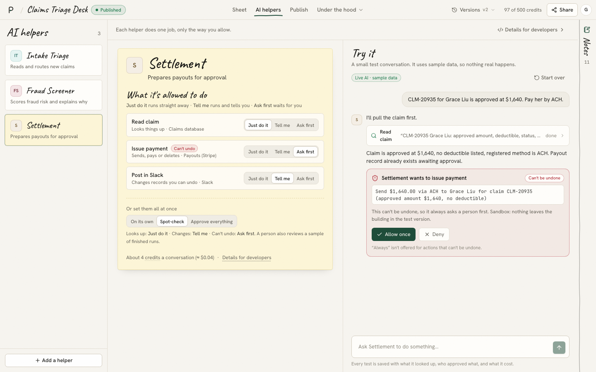
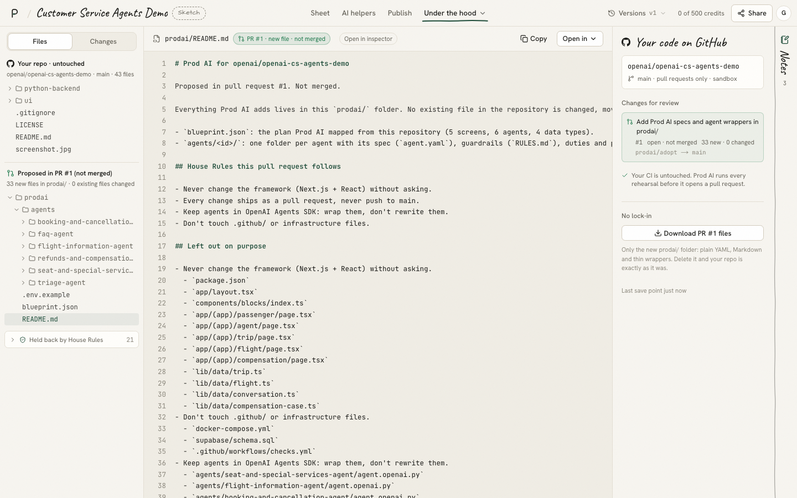
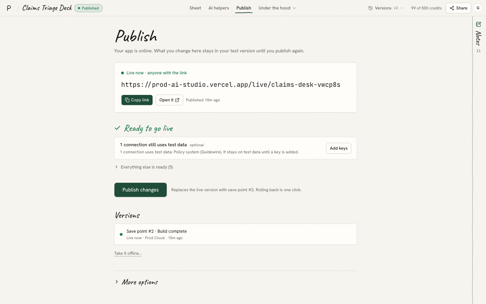
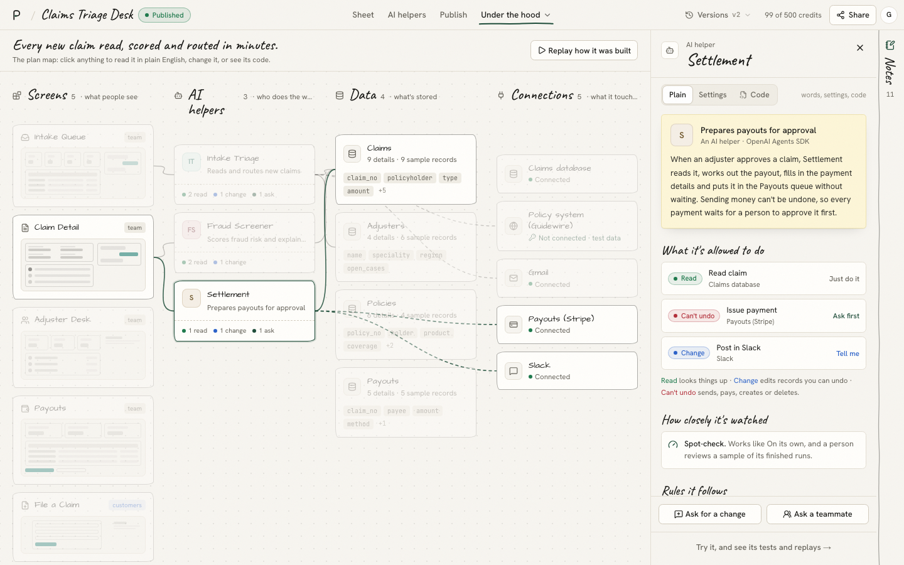

# Prod AI

**Sketch your app. Get a production app.** Write what you want in plain words; Prod AI draws it in pencil first, then makes it a real, governed agentic app when you say so. One product for the people who don't code and the people who do.

My answer to Lyzr's **Architect 2.0** brief ("a vibe-coding platform for both technical and non-technical users"), built for the *Technical Product Manager · Architect* take-home.

*Why the name:* **prod** is what engineers call production, where software has to survive real users, real money and real mistakes. Every AI builder demos well on the first prompt; Prod AI is built for prod.

**[Live app](https://prod-ai-studio.vercel.app)** · **[Open a finished example (no account)](https://prod-ai-studio.vercel.app/demo)** · **[Technical architecture](ARCHITECTURE.md)** ([interactive diagram](https://prod-ai-studio.vercel.app/architecture)) · [Market research](RESEARCH.md) · [Product decisions](DECISIONS.md) · [Screenshots](#screenshots)



---

## The idea

**Start from what the person needs, not from how builders look today.** Someone with an idea wants three things: to see what they'll get before paying for it, to change it without learning a tool, and to trust it once real customers and real money are involved. An engineer on the same team wants the code, the diff and a say in what ships. The brief asked for first principles and said not to copy the current Architect or any other platform, so Prod AI drops the layout almost every builder shares (chat on the left, preview on the right) and starts from something everyone already understands.

- **Paper and pencil.** A pencil sketch says "rough, cheap to change" without a word of copy, which is exactly the state a plan is in. So a project moves through the states a real design does: a **sketch** (the plan, with its price), **inking** (the build: each screen turns from pencil into the real screen) and **"It's real."** (the working app, on the same sheet).
- **Notes in the margin, not a chat panel.** You mark up a draft by writing next to it. A note, or a note pinned to the part of the app you pointed at, gets a reply with the change in plain words and its price, then **Apply** or **Not now**, then "Applied · version N" with **Undo**. A chat scrolls away and blurs requests, answers and costs; a margin note ends in a decision and becomes the project's history. This is the brief's chat window, rethought: every note is a saved thread with replies, and each AI helper also has its own **Try it** chat.
- **One product for both audiences, with depth under the hood.** No builder mode and developer mode. The Sheet, AI helpers and Publish speak plain English. **Under the hood** holds the Plan map (every object with Plain, Settings and Code faces), Preview and tweak, Code and GitHub, and Handoffs. An ops lead can read the rule that blocked a payment; an engineer can read the plain summary before a review.
- **Designed for turn three.** Nothing runs without a price. Anything an AI helper does that can't be undone **asks a person first**. When a test run catches a problem, the fix for Prod AI's own mistake is **free** and labelled so.

## Try it in 3 minutes

1. Open **[prod-ai-studio.vercel.app](https://prod-ai-studio.vercel.app)**, write what you want on the ruled sheet (or pick *Claims desk*), and press **Make it**.
2. Sign in with Google or an email link, or **continue as a guest** (you start from scratch; nothing is seeded).
3. Answer the few questions (or **Skip, use sensible defaults**) and watch the plan being drawn as a sketch.
4. On the **Sheet**, read your app as a pencil sketch: screen cards, AI helpers as sticky notes, connections, and the price on ruled lines. Press **Make it real** and watch each screen ink in (**Skip to end** if you're in a hurry).
5. A test run catches a problem: pick one of the two free fixes in the note on the sheet. Then **"It's real."**: try the app, switch devices, or **Point and write a note**.
6. Write a note in the margin, e.g. *"Add a column for priority"*. Read the change and its price, **Apply** it, then **Undo** if you like.
7. **AI helpers** → pick one → **Try it**. Ask it to do something that can't be undone and it stops to ask you first. On the [example project](https://prod-ai-studio.vercel.app/demo), pick **Settlement** and send *"CLM-20935 for Grace Liu is approved at $1,640. Pay her by ACH."*
8. **Publish** → one button → open the real public `/live` URL.

Short on time? **[/demo](https://prod-ai-studio.vercel.app/demo)** opens a finished, published example (a *Claims Triage Desk*) on its Sheet.

<a id="screenshots"></a>

## Screenshots

| | |
| --- | --- |
|  **Landing.** Write what you want, then Make it. |  **The sketch.** Planned by Claude, priced, nothing built yet. |
|  **Inking.** Each screen goes from pencil to real; the build is labelled simulated. |  **A test run catches a problem.** Two fixes, both free. |
|  **"It's real."** The working app on the same sheet. |  **A note in the margin.** The change in plain words, its price, Apply or Not now. |
|  **AI helpers.** What it's allowed to do, and Try it asking before it pays. |  **Import.** Your repo stays untouched; new files arrive as PR #1. |
|  **Publish.** Only what needs attention, one button, versions. |  **Under the hood.** The Plan map and its inspector. |

## For developers

Everything technical is one click away in **Under the hood**, and it is real code over the same plan:

- **Plan map.** The blueprint canvas: screens, AI helpers, data and connections with live relations. Click anything for an inspector with **Plain · Settings · Code** faces (the generated files for that object).
- **Preview and tweak.** Use the app on desktop, tablet and phone; point-and-tweak copy and columns for free; pin comments.
- **Code and GitHub.** A file tree of every generated file, diffs between any two versions, a real `.zip` download, and a sandboxed GitHub panel (branch and PR per change).
- **Handoffs.** "Ask a teammate" sends the object, the brief, recent notes and the latest diff; the engineer sees code; the answer comes back as a plain-English line.
- **AI helpers → Details for developers.** Test runs (rehearsals), replay and audit log, the same helper as code in **six frameworks** (Lyzr ADK, LangGraph, CrewAI, OpenAI Agents SDK, Google ADK, Mastra) with "what doesn't translate", its job description (`agent.yaml`, `SOUL.md`, `RULES.md`, `DUTIES.md`) and memory.
- **Import** (`/new?mode=import`). Paste a public repo (try `github.com/openai/openai-cs-agents-demo`). Prod AI reads it for real, detects the stack and parses the real agents and tools, agrees **House Rules** with you ("never change the framework", "pull requests only"), shows **"Your repo · untouched"**, and proposes new files in one `prodai/` folder as **PR #1**, with anything a rule protects held back and listed.

## Technical architecture

The production design, service by service, is in **[ARCHITECTURE.md](ARCHITECTURE.md)** and drawn at **[/architecture](https://prod-ai-studio.vercel.app/architecture)** ([PNG](public/docs/architecture-diagram.png) · [PDF](public/docs/architecture.pdf)).


- **Sandboxing:** one Firecracker microVM per project (strong isolation, ~150 ms snapshot resume, Python and Node agents), no secrets inside the VM, allow-listed egress.
- **Agent harness:** planner, coder, verifier and repairer share one tool loop with credit, step and time budgets. The same error twice stops the loop, rolls back and hands it to a person.
- **Model-agnostic:** a model gateway routes by task (plan, code, summarise), fails over between Claude, GPT, Gemini and open models, supports BYOK, and meters every call. Switches are gated on eval suites.
- **Live preview:** the sandbox dev server behind a preview proxy on a separate domain, with WebSockets for hot reload and wake-on-request. Build events stream through a realtime hub, which is what inks the Sheet in production.
- **GitHub and code sync:** a GitHub App, a branch and PR per change (a Work Order). An ownership map and region markers keep generated code and hand-written code apart; edits to generated files go through a three-way merge and parse back into the plan, or the object becomes code-owned.
- **Deployment:** build once, immutable releases, canary rollout, instant rollback, to Prod Cloud, Vercel or your VPC. Live apps hold no provider secrets and have default-deny egress: every outbound call goes through an agent gateway that checks permissions, approvals and caps before adding credentials, so a bypass fails closed.
- **Scale and cost:** stateless control plane in regional cells of ~1,000 active users, durable workflows, warm pools and idle suspend, priority queues per model provider. Model spend is modelled at about $9.30 per active builder a month, with caps on repair loops.

**How the prototype is built.** Next.js 16 (App Router, React 19), Tailwind v4 + shadcn/ui, TypeScript strict; Supabase Auth (Google, email link, anonymous guests you can keep) and Postgres with row-level security on every table; Claude via the Vercel AI SDK (structured outputs, streaming, tool approval); deployed on Vercel.

- **One source of truth.** A project is a validated JSON *Blueprint* (screens, agents, data, connections). The sketch, the real app on the Sheet, the public live site, the generated code, the diffs and the build timeline are all pure functions of it ([`lib/blueprint/schema.ts`](lib/blueprint/schema.ts)).
- **The model decides; code lays out.** The planner asks Claude for the *decisions* (which helpers, which tools and how risky, which data), then expands them deterministically and validates every reference before saving ([`lib/llm`](lib/llm)). Prices are computed by code, never by the model.
- **Every model call has a scripted path.** No key, a timeout, an error or a spent daily budget all fall back to starter plans, rule-based changes and a scripted agent run that still uses the real approval protocol.
- **Approval gates are real.** Permissions compile to AI SDK tool approval in Try it and to each framework's own mechanism in generated code: LangGraph `interrupt()`, OpenAI Agents `needs_approval`, ADK tool confirmation, CrewAI hooks, Mastra `requireApproval`.
- **Security.** No service-role key anywhere: every write goes through the user's session and row-level security. Guests are capped at 8 projects and a daily model budget.

## What's real and what's simulated

| Flow | Where | Real or simulated |
| --- | --- | --- |
| Sign in with Google or an email link; guest sessions you can keep | `/login`, `/start` | **Real** (Supabase Auth, anonymous → linked identity). GitHub sign-in is wired but not switched on in this deployment |
| Brief-aware questions → plan drawn as a sketch | `/new` | **Real** (a fast Claude call for the questions; the plan by Claude, structured and streamed); starter plans offline |
| The sketch, its price, Make it real | Sheet `/p/:id` | **Real** plan and computed price |
| The build: screens inking in, test runs, the fix note, stop = refund | Sheet | **Simulated, and labelled so on the sheet**: a scripted timeline over the real plan. The fix you pick really changes the plan; versions and the credit ledger are real |
| "It's real.": the app on the Sheet, device switch, point and write a note | Sheet | **Real** spec-driven renderer over the real plan and sample data (the generated Next.js code is not executed) |
| Notes in the margin → priced change → Apply → version N, Undo; questions answered | Margin | **Real** (Claude returns typed edits that code compiles and validates, with one self-repair retry); saved as threads; rule-based offline |
| AI helpers: what each may do, Try it with an approval gate | `/p/:id/agents` | **Real** (Claude + AI SDK tool approval); tools run on sandboxed sample data |
| Test runs, replay, audit log | AI helpers → Details for developers | Deterministic judge over the real plan; replay and log are real records |
| Same helper in six frameworks | AI helpers, Code and GitHub | **Real** generated code (shown and downloadable, not executed) |
| Plan map with Plain · Settings · Code inspector | Under the hood | **Real** |
| Preview and tweak, comment pins | Under the hood | **Real** (persisted edits and comments) |
| File tree, diffs between versions, `.zip` download | Under the hood → Code and GitHub | **Real** |
| GitHub: connect, branch per change, PRs, two-way sync | Code and GitHub | **Sandboxed** |
| Import a public repo: stack, agents and tools, House Rules, PR #1 in `prodai/` | `/new?mode=import` | **Real** GitHub reads, detection and parsing; mapping by Claude; the PR is proposed, not pushed |
| Publish: what needs attention, versions, rollback | `/p/:id/ship` | **Real** public URL on Prod Cloud; Vercel, VPC and custom domains are sandboxed |
| The live app | `/live/:slug` | **Real** |
| Handoffs: ask a teammate → engineer view → plain-English resolution | Under the hood → Handoffs | Real persistence; the teammate is simulated |
| Spend meter, budget caps | Top bar, `/settings` | **Real** token counts; build and change prices are estimates |

Anything simulated or sandboxed is labelled in the product.

## How it maps to Lyzr

| Prod AI | Lyzr today |
| --- | --- |
| A helper's job description (`agent.yaml`, `SOUL.md`, `RULES.md`, `DUTIES.md`) | GitAgent |
| "What it's allowed to do", ask-first approvals | Opencontroller identity and approval gates, pulled into the build loop |
| Test runs (rehearsals) | The simulation engine |
| Replay and audit log | Opencontroller observability |
| Memory | Cognis |
| "Run on Lyzr ADK" by default; six frameworks supported | Lyzr ADK, plus Opencontroller's framework registry |
| Prod Cloud / your VPC | Managed, hybrid and on-prem deployment |

The bet: Architect today prototypes and Opencontroller governs. Prod AI moves governance forward into the moment an app is sketched, in words a non-technical owner understands.

## What I'd measure

- Time from first note to first live URL
- Share of sketches that get made real, and notes that get applied
- Credits spent on our own fixes (target: zero, by design)
- Share of can't-undo actions with an approval gate at publish
- Test-run pass rate over time, per helper
- Handoff resolution time, and how often business users open Under the hood

## Run it locally

Requires Node 22+ and Docker (for the local Supabase stack).

```sh
npm install
npx supabase start            # local Postgres + Auth; applies supabase/migrations
cp .env.example .env.local    # fill in the values printed by `npx supabase status`
npm run dev                   # http://localhost:3000
```

Environment variables ([`.env.example`](.env.example)):

| Variable | What it's for |
| --- | --- |
| `NEXT_PUBLIC_SUPABASE_URL`, `NEXT_PUBLIC_SUPABASE_PUBLISHABLE_KEY` | Supabase project (Project Settings → API Keys) |
| `NEXT_PUBLIC_SITE_URL` | Your deployed URL, used for sign-in redirects and live links |
| `LLM_PROVIDER` | `anthropic`, or `none` to run everything in scripted mode without a key |
| `LLM_MODEL` | The main model (planning, changes, Try it), e.g. `claude-opus-5` |
| `LLM_FAST_MODEL` | Optional faster model for the questions on `/new` (falls back to `LLM_MODEL` at low effort) |
| `ANTHROPIC_API_KEY` | Your Anthropic key |
| `GITHUB_TOKEN` | Optional, no scopes: raises the import rate limit from 60 to 5,000 requests an hour |

Useful routes: `/start` signs in as a guest and opens `/new` from scratch; `/demo` opens the finished example project for reviewers.

**Tests.** Playwright runs the reviewer's path end to end (landing, plan map and inspector, tweak, Try it approval, a margin note → Apply → new version, Publish and the live URL, a new project built through the fix note, import with House Rules, a handoff). Point it at a running server:

```sh
BASE_URL=http://localhost:3000 npx playwright test
BASE_URL=https://prod-ai-studio.vercel.app npx playwright test
```

`node scripts/readme-shots.mjs <base-url> docs/screenshots` regenerates the screenshots above.

## Deploy your own

1. Create a Supabase project and run [`supabase/migrations/20260925000000_init.sql`](supabase/migrations/20260925000000_init.sql) in the SQL editor.
2. Supabase → Authentication → Sign In / Providers: enable **Anonymous sign-ins** and **Manual linking** (so a guest can keep their work), email, and Google (GitHub optional).
3. Supabase → Authentication → URL Configuration: set **Site URL** to your deployed URL (e.g. `https://<your-app>.vercel.app`) and add **Redirect URLs** `https://<your-app>.vercel.app/auth/callback` and, for local work, `http://localhost:3000/auth/callback`.
4. Import the repo in Vercel and set the variables above, with `NEXT_PUBLIC_SITE_URL` matching the Site URL.

## Project structure

```
ARCHITECTURE.md        production architecture: sandboxes, harness, model gateway, proxy, GitHub, deploy, scale
DECISIONS.md           the product calls, and what was rejected
RESEARCH.md            nine products compared, and the gaps Prod AI targets
public/docs            architecture diagram (PNG, PDF)
app/                   routes: landing, login, start, demo, home, new, settings, architecture, live/[slug],
                       p/[id] (the Sheet) + p/[id]/{agents,ship,blueprint,preview,code,handoffs}, api/*
components/landing     the landing page's writing sheet and sketches
components/new         /new: questions, connections, the plan drawn as a sketch
components/workspace   the project: shell, top bar (Sheet, AI helpers, Publish, Under the hood)
  sheet/               the Sheet: screen sketches, helper sticky notes, price note, build progress and inking,
                       the fix note, the real app with device switch and point-and-write-a-note
  rail.tsx             the margin: notes, replies and history as threads
  composer-dock.tsx    writing a note, and the priced change with Apply / Not now
  agents/              AI helpers: note cards, what each may do, Try it, details for developers
  ship/                Publish: what needs attention, live URL, versions, rollback
  blueprint/ inspector/ preview/ code/ handoffs/   Under the hood
components/agents      the Try it chat and its approval gate
components/import      the import wizard and House Rules
components/renderer    the spec-driven app renderer (the real app on the Sheet, Preview and /live)
lib/blueprint          schema, fixtures, validation, estimates, plain-English descriptions
lib/llm                planner (draft → blueprint), questions, streaming, provider, pricing, daily budget
lib/change             notes → typed edits → validated changes
lib/agents             Try it tools, approval mapping, scripted fallback
lib/codegen            generated files, job-description files, six framework templates, diffs, the import PR #1
lib/import             GitHub reads, stack and agent detection, House Rules, mapping
lib/sim                build timeline, fixes, test runs, preflight
lib/demo               the finished example behind /demo
supabase/migrations    schema and row-level security
tests/                 Playwright end-to-end tests
scripts/               screenshot scripts
```

Built by Aryan Saharan. MIT licensed.
