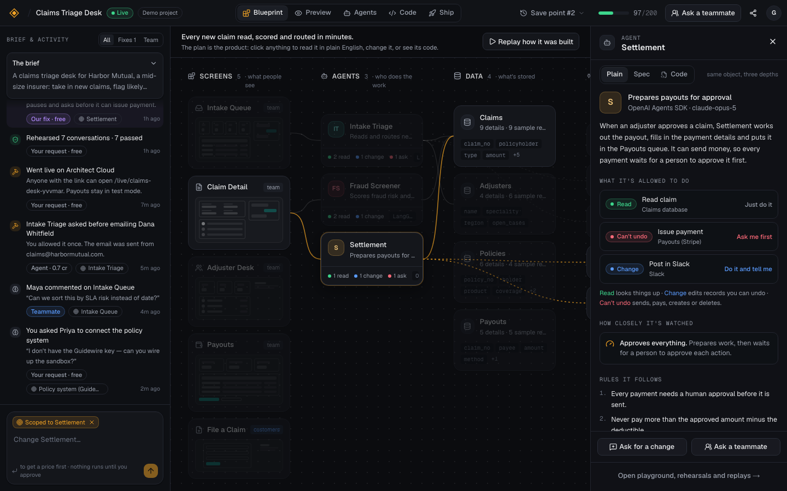
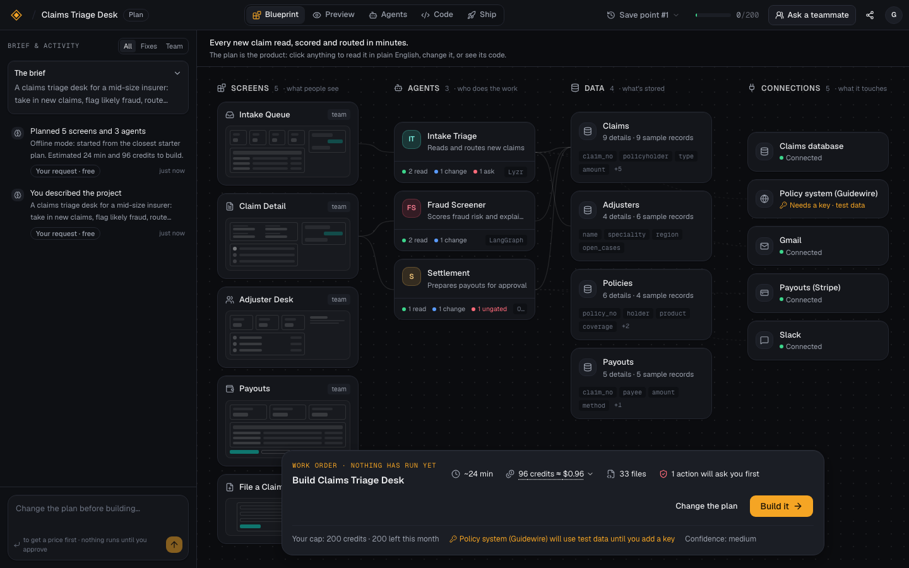
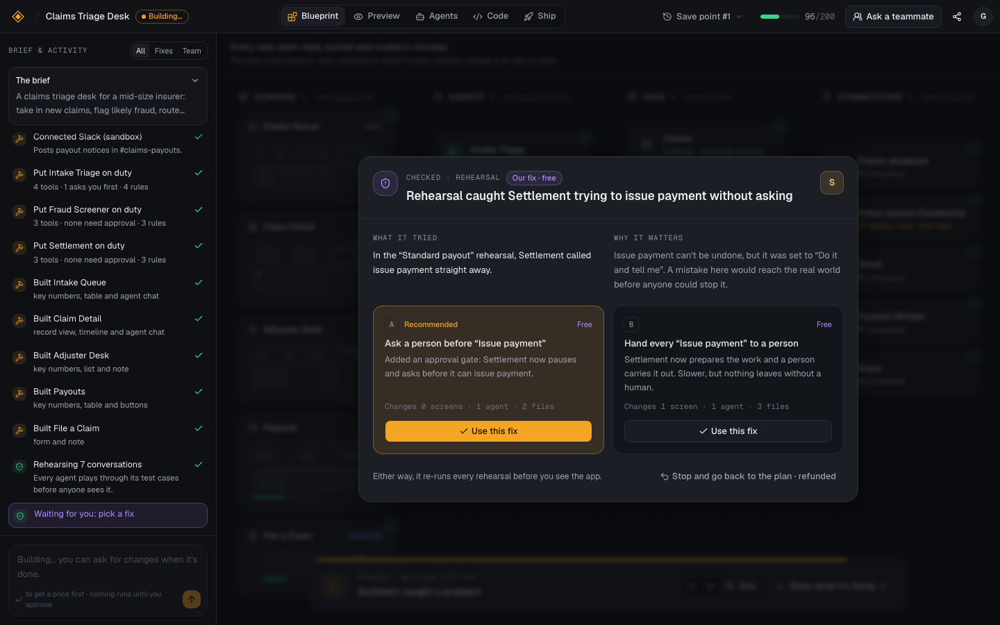
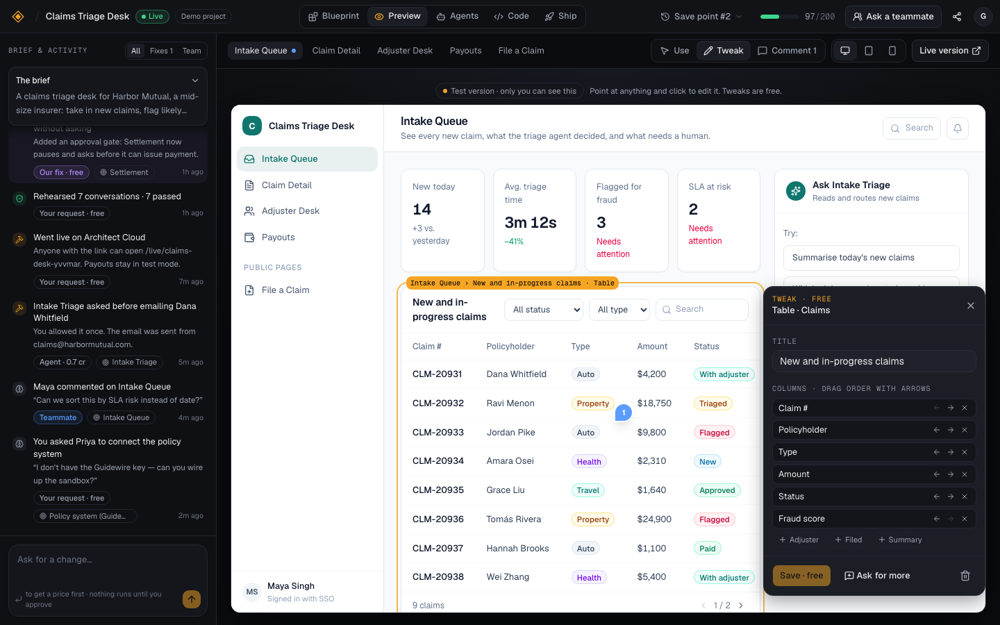
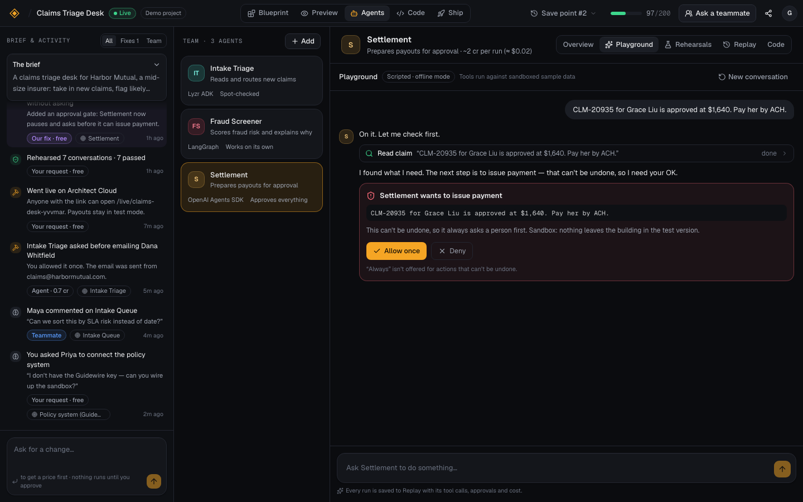
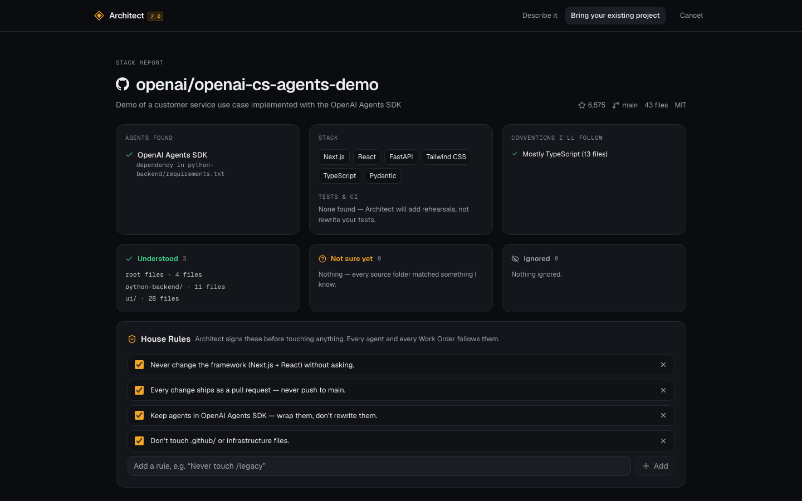
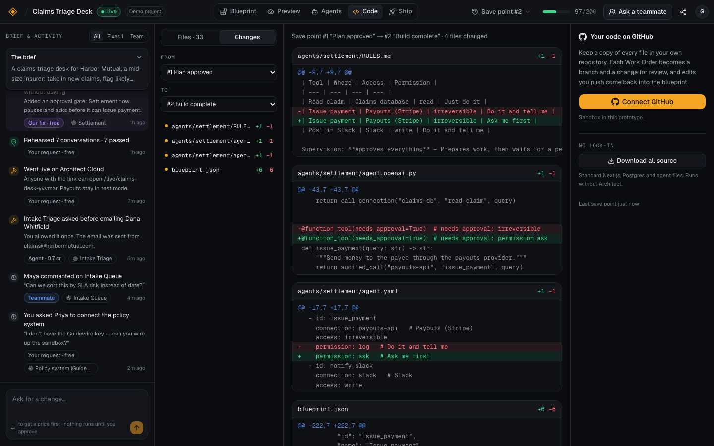
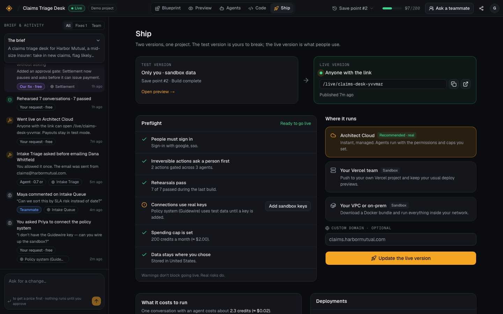
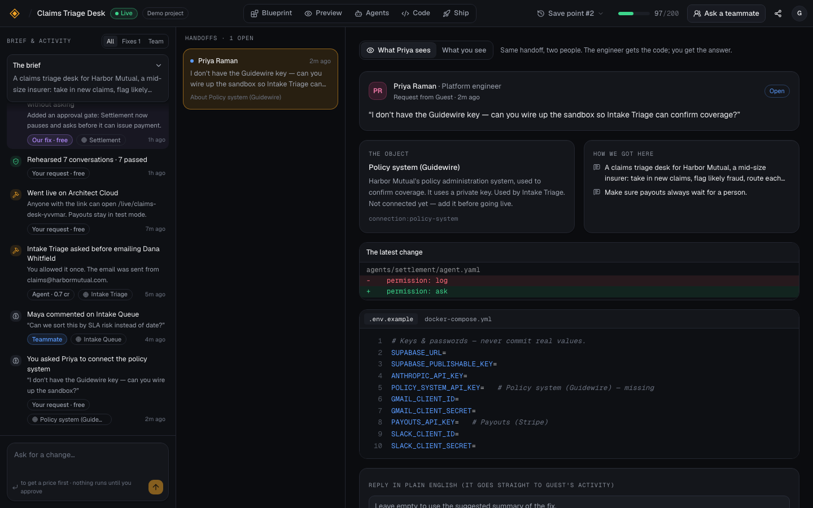

# Architect 2.0

**Agentic apps you'd trust in production — built by the people who don't code and the people who do, in the same project.**

A working prototype of the next Lyzr Architect, built for the *Technical Product Manager · Architect* take-home.

**[Live demo](https://architect-2.vercel.app)** · **[Open the demo project — no account](https://architect-2.vercel.app/demo)** · **[2-minute walkthrough](#walkthrough)** · [Product decisions](DECISIONS.md)



---

## The idea

Every AI app builder looks great on the first prompt. The trouble starts on the third: something breaks, something costs money, or something needs a person who can read code. Architect 2.0 is designed for that moment.

Four principles, each of them visible in the product:

| Principle | What you see |
| --- | --- |
| **1. Depth is per object, not per person.** There is no "developer mode". | Every screen, agent and connection opens in an Inspector with three faces: **Plain** (what it does, in English) · **Spec** (editable settings) · **Code** (the generated files). An ops lead can read code when it matters; an engineer can read the plain summary when reviewing. |
| **2. Agents are colleagues you put on duty.** | Every tool is marked **Read**, **Change** or **Can't undo**. Anything irreversible **asks a person first** — in the playground, with a real approval gate on Claude. Agents have rules, a supervision level, rehearsals (tests), a replay log and a cost per run. |
| **3. Designed for turn three.** | Every build and change starts as a **Work Order** with a price. The build **rehearses** every agent and, when it finds a problem, shows *what it tried, why it matters and two ways to fix it* — labelled **Our fix · free**. Every change is a **save point**; going back is free. |
| **4. The handoff is the product.** | **Ask a teammate** sends the object, your brief, your recent requests and the latest diff. The engineer sees code; you get the answer back as a sentence. Pinned comments on the preview feed the same loop. |

## Try it in two minutes

1. Open **[/demo](https://architect-2.vercel.app/demo)**. You get a guest session and a finished *Claims Triage Desk* with three agents, a live URL, a caught mistake and a pending handoff.
2. Click **Settlement** on the canvas → flip the Inspector between Plain, Spec and Code.
3. **Preview** → switch to **Tweak** → click the claims table → rename or reorder columns. Free, and it makes a save point.
4. **Agents → Settlement → Playground** → *"CLM-20935 for Grace Liu is approved at $1,640. Pay her by ACH."* Watch it look the claim up, then stop and ask before sending money.
5. **Ship** → Preflight is green → open the live URL.
6. **Home → Describe it** → plan a new app. The plan streams in as Claude decides it. **Build it** → the rehearsal catches a problem → pick a fix.
7. **Home → Bring your existing project** → paste `github.com/openai/openai-cs-agents-demo`. Architect reads the real repo, detects the stack and agents, and signs House Rules before mapping it.

<a id="walkthrough"></a>
**Walkthrough video:** _link added before submission_

| | |
| --- | --- |
|  |  |
|  |  |
|  |  |
|  |  |

## Every flow

| Flow | Where | Real or simulated |
| --- | --- | --- |
| Sign in with Google, GitHub or an email link; guest sessions you can keep | `/login`, `/demo` | **Real** (Supabase Auth, anonymous → linked identity) |
| Describe → 3 quick questions → plan streams in → Work Order | `/new` | **Real** (Claude, structured output, streamed); starter plans offline |
| Blueprint canvas with live relations; Inspector Plain / Spec / Code | `/p/:id/blueprint` | **Real** |
| Build with rehearsals and a repair decision; stop = refund | Blueprint | Scripted timeline over the **real** plan; save points and ledger are real |
| Preview the generated app on desktop, tablet and phone; Tweak; Comment | `/p/:id/preview` | **Real** (spec-driven renderer, persisted edits and comments) |
| Ask for a change → priced Work Order → approve → save point | Activity rail | **Real** (Claude proposes JSON-pointer edits; validated before applying); rules offline |
| Agent playground with approval gates, replay and audit log | `/p/:id/agents` | **Real** (Claude + AI SDK tool approval; tools run on sandboxed sample data) |
| Rehearsals and reliability | Agents → Rehearsals | Deterministic judge over the real blueprint |
| Same agent in six frameworks, with "what doesn't translate" | Agents → Code, `/p/:id/code` | **Real** generated code (Lyzr ADK, LangGraph, CrewAI, OpenAI Agents SDK, Google ADK, Mastra) |
| File tree, diffs between any two save points, download all source | `/p/:id/code` | **Real** |
| GitHub: connect, branch per change, reviews, two-way sync | Code tab | Sandbox |
| Import a public repo: stack, agents, tests, coverage map, House Rules | `/new?mode=import` | **Real** GitHub reads and detection; mapping by Claude |
| Preflight, deploy targets, go live, roll back, cost projection | `/p/:id/ship` | **Real** live URL on Architect Cloud; Vercel / VPC / domains sandboxed |
| Public live version | `/live/:slug` | **Real** |
| Ask a teammate → engineer's view → plain-English resolution | `/p/:id/handoffs` | Real persistence; the teammate is simulated |
| Spend meter, budget caps, usage by agent | Top bar, `/settings` | **Real** token counts; build and change prices are estimates |

Anything simulated is labelled in the product.

## How it's built

```
Next.js 16 (App Router, React 19)  ·  Tailwind v4 + shadcn/ui (Radix)  ·  TypeScript strict
Supabase: Auth (Google, GitHub, email, anonymous) + Postgres with row-level security on every table
Claude (claude-opus-5) via the Vercel AI SDK 7: structured outputs, streaming, tool approval
Deployed on Vercel
```

- **One source of truth.** A project is a validated JSON *Blueprint* (screens, agents, data, connections). The canvas, the preview, the public live site, the generated code, the diffs and the build script are all pure functions of it. That is what makes "same object, three depths" cheap and consistent. See [`lib/blueprint/schema.ts`](lib/blueprint/schema.ts).
- **The model decides; code lays out.** The planner asks Claude for the *decisions* — which agents, which tools and how risky, which data — then expands them deterministically into screens and blocks, and validates referential integrity before saving ([`lib/llm`](lib/llm)).
- **Every model call has a scripted path.** No key, a timeout, an error, or a spent daily budget all fall back to starter plans, rule-based changes and a scripted agent run that still exercises the real approval protocol. The demo never shows an error because of the model.
- **Approval gates are real.** Blueprint permissions compile to AI SDK `toolApproval` in the playground and to each framework's own mechanism in generated code: LangGraph `interrupt()`, OpenAI Agents `needs_approval`, ADK tool confirmation, CrewAI hooks, Mastra `requireApproval`.
- **Security.** No service-role key anywhere: every write goes through the user's session and row-level security. Guests are capped at 8 projects and a daily model budget.
- **Tested.** Playwright covers the reviewer's path end to end: demo, inspector, tweak, playground approval, change Work Order, go live, new project build with repair, import and handoff.

## How it maps to Lyzr

| Architect 2.0 | Lyzr today |
| --- | --- |
| Agent files (`agent.yaml`, `SOUL.md`, `RULES.md`, `DUTIES.md`) | GitAgent |
| Permissions, supervision, approval inbox | Opencontroller identity and approval gates, pulled into the build loop |
| Rehearsals and reliability | The simulation engine |
| Replay and audit log | Opencontroller observability |
| Memory scopes | Cognis |
| "Run on Lyzr ADK" default; any framework supported | Lyzr ADK, plus Opencontroller's framework registry |
| Architect Cloud / your VPC | Managed, hybrid and on-prem deployment |

The bet: Architect today prototypes and Opencontroller governs. Architect 2.0 moves governance forward into the moment an app is designed, in language a non-technical owner understands.

## What I'd measure

- Time from first prompt to first live URL
- Credits spent on our own fixes (target: zero, by design)
- Share of irreversible tools with an approval gate at go-live
- Rehearsal pass rate over time, per agent
- Handoff resolution time, and how often business users open the Code face

## Run it locally

Requires Node 22+ and Docker (for the local Supabase stack).

```sh
npm install
npx supabase start            # local Postgres + Auth; applies supabase/migrations
cp .env.example .env.local    # fill in the values printed by `npx supabase status`
npm run dev                   # http://localhost:3000
npm run test:e2e              # Playwright, against the dev server
```

Set `LLM_PROVIDER=none` to run everything in scripted mode without an API key.

## Deploy your own

1. Create a Supabase project and run [`supabase/migrations/20260925000000_init.sql`](supabase/migrations/20260925000000_init.sql) in the SQL editor.
2. In Supabase → Authentication: enable **Anonymous sign-ins** and **Manual linking**; add Google and GitHub providers; set the Site URL and redirect URLs to your domain.
3. Import the repo in Vercel and set the variables from [`.env.example`](.env.example).

## Repo map

```
app/                 routes: landing, login, demo, home, new, settings, live, p/[id]/{blueprint,preview,agents,code,ship,handoffs}, api/*
components/workspace the studio: top bar, activity rail, inspector, canvas, preview, agents, code, ship, handoffs
components/renderer  the spec-driven app renderer (Preview and /live)
lib/blueprint        schema, fixtures, validation, estimates, plain-English descriptions
lib/llm              planner (draft → blueprint), streaming, provider, pricing, daily budget
lib/agents           playground tools, approval mapping, scripted fallback
lib/codegen          generated files, GitAgent files, six framework templates, diffs
lib/import           GitHub reads, stack and agent detection, House Rules
lib/sim              build timeline, repair plans, rehearsals, preflight
supabase/migrations  schema and row-level security
tests/               Playwright end-to-end tests
```

Built by Aryan Saharan. MIT licensed.
